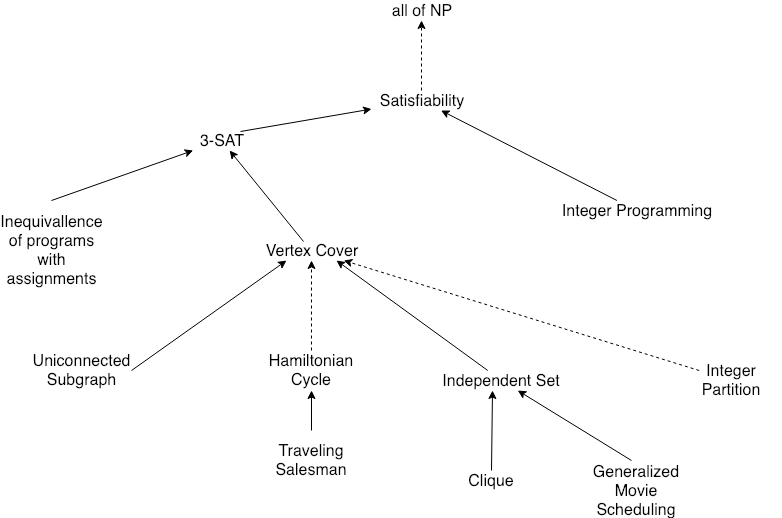

**Reductions** are operations that convert one problem into another

An algorithmic _problem_ is a general question with parameters for input and conditions on what makes for a satisfactory solution. An _instance_ is a problem with the input parameters specified.

**Example**:
_Problem_: The Traveling Salesman Problem (TSP)<br/>
_Input_: A weighted graph _G_<br/>
_Output_: Which tour {v<sub>1</sub>, v<sub>2</sub>,...v<sub>n</sub>} minimizes
?

Any weighted graph defines an instance of TSP. Each _instance_ has at least one minimum cost tour. The general traveling salesman _problem_ asks for an algorithm to find the optimal tour for all possible instances.

```
Bandersnatch(G)
    Translate the input G to an instance Y of Bo-Billy Problem
    Call the subroutine Bo-Billy on Y to solve Bandersnatch(G)
    Bandersnatch(G) = Bo-Billy(Y)
```

### Take Home:

Reductions are a way to show that two problems are essentially identical. A fast algorithm (or lack of one) for one of the problems implies a fast algorithm (or lack of one) for the other.

A translation of instances from one type of problem to instances of another such that the answers are preserved is what is meant by a reduction.

#### Decision Problems

Class of problems whose answers are restricted to true and false are known as decision problems.

**Portion of reduction tree for NP Complete Problems - solid lines are reductions covered in chapter**



### Art of Proving Hardness

- Make source problem as simple (i.e., restricted) as possible
- Make your target as hard as possible
- Select the right problem for the right reason
- Amplify penalties for making undesired selections
- Think strategically at a high level, then build gadgets to enforce tactics
- When you get stuck, alternate between looking for an algorithm or a reduction

### Take Home:

Approximation algorithms guarantee answers that are always close to the optimal solution. They can provide a practical approach to dealing with NP-complete problems.

#### Note from Note-Taker:

This chapter was very math-based and I skipped over the majority of it.
