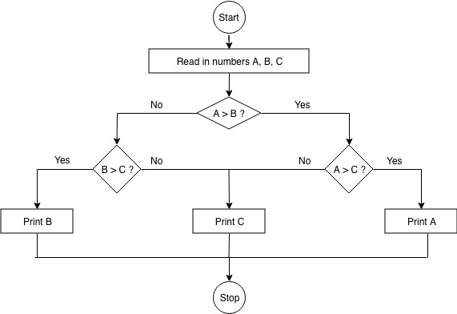

## 1.1 Ideas

### Guidelines for Flowcharts:

- Write states and instruction steps inside rectangles
- Write decision steps, where the process might go in different directions, inside diamonds
- Never mix an instruction step with a decision step
- Connect sequential steps with arrows
- Mark the start and end of the process
  (ISO spec for how software systems diagrams should be drawn: UML - http://code.energy/UML )

#### Example: Finding maximum value between three variables:



**Pseudocode**: Human-friendly code not understood by machines.

#### Example:

```
function maximum (A, B, C)
if A > B
    if A > C
        max <- A
    else
        max <- C
else
    if B > C
        max <- B
    else
        max <- C
print max
```

**Model**: A set of concepts that represents a problem and its characteristics

### Livestock Fence:

Your farm has two types of livestock. You have 100 units of barbed wire to make a rectangular fence for the animals with a straight division for separating them. How do you frame the fence in order to maximize the pasture area?

```
A = w x l
100 = 2w + 3l
l = (100 - 2w)/3
A = 100/3w - 2/3w^2
```

Quadratic eqautation! Set A = 0, solve the equation, and the maximum is the midway point between the two roots.

## 1.2 Logic

In mathematical logic, variables and operators represent validity or truth of things.

Example statement:
"If the water is warm, I'll swim" can be broken down into two logical variables, A and B

```
A: The water is warm
B: I swim
```

Dependency between the variables is represented by a conditional operator (`->`). A->B is used to represent the idea that A = True implies B = True.

To negate ideas, use `!` operator (negation operator)

**Contrapositive**: For any two variables, A and B, `A->B = !A->!B`

**Biconditional**: If A->B and B->A, can be represented as A<->B. A->B does not necessarily mean that B->A.

<style type="text/css">
.tg  {border-collapse:collapse;border-spacing:0;}
.tg td{font-family:Arial, sans-serif;font-size:14px;padding:10px 20px;border-style:solid;border-width:1px;overflow:hidden;word-break:normal;border-color:black;}
.tg th{font-family:Arial, sans-serif;font-size:14px;font-weight:normal;padding:10px 20px;border-style:solid;border-width:1px;overflow:hidden;word-break:normal;border-color:black;}
.tg .tg-baqh{text-align:center;vertical-align:top}
.tg .tg-1l4x{font-size: x-large;;border-color:inherit;text-align:center}
.tg .tg-49rs{font-size: x-large;;border-color:inherit;text-align:center;vertical-align:top}
</style>

<table class="tg">
  <tr>
    <th class="tg-1l4x">A</th>
    <th class="tg-1l4x">B</th>
    <th class="tg-1l4x">!A</th>
    <th class="tg-1l4x">A-&gt;B</th>
    <th class="tg-1l4x">A&lt;-&gt;B</th>
    <th class="tg-1l4x">A AND B</th>
    <th class="tg-49rs">A OR B</th>
    <th class="tg-49rs">A XOR B</th>
  </tr>
  <tr>
    <td class="tg-baqh">✓</td>
    <td class="tg-baqh">✓</td>
    <td class="tg-baqh">❌</td>
    <td class="tg-baqh">✓</td>
    <td class="tg-baqh">✓</td>
    <td class="tg-baqh">✓</td>
    <td class="tg-baqh">✓</td>
    <td class="tg-baqh">❌</td>
  </tr>
  <tr>
    <td class="tg-baqh">✓</td>
    <td class="tg-baqh">❌</td>
    <td class="tg-baqh">❌</td>
    <td class="tg-baqh">❌</td>
    <td class="tg-baqh">❌</td>
    <td class="tg-baqh">❌</td>
    <td class="tg-baqh">✓</td>
    <td class="tg-baqh">✓</td>
  </tr>
  <tr>
    <td class="tg-baqh">❌</td>
    <td class="tg-baqh">✓</td>
    <td class="tg-baqh">✓</td>
    <td class="tg-baqh">✓</td>
    <td class="tg-baqh">❌</td>
    <td class="tg-baqh">❌</td>
    <td class="tg-baqh">✓</td>
    <td class="tg-baqh">✓</td>
  </tr>
  <tr>
    <td class="tg-baqh">❌</td>
    <td class="tg-baqh">❌</td>
    <td class="tg-baqh">✓</td>
    <td class="tg-baqh">✓</td>
    <td class="tg-baqh">✓</td>
    <td class="tg-baqh">❌</td>
    <td class="tg-baqh">❌</td>
    <td class="tg-baqh">❌</td>
  </tr>
</table>

### Boolean Algebra (Simplifies logical expressions)

**Associativity**: Parentheses are irrelevant for sequences of AND or OR operations - can be calculated in any order.

```
A AND (B AND C) = (A AND B) AND C,
A OR (B OR C) = (A OR B) OR C
```

**Distributivity**: ANDing after an OR is equivalent to ORing results of ANDs and vice versa

```
A AND (B OR C) = (A AND B) OR (A AND C)
A OR (B AND C) = (A OR B) AND (A OR C)
```

**DeMorgan's Law**
"It can't be summer and winter at once, so it's either not summer or not winter. And it's not summer and not winter if and only if it's not the case it's either summer or winter" Following this logic, ANDs can be transformed into ORs and vice versa:

```
!(A AND B) = !A OR !B,
!A AND !B = !(A OR B)
```

### Problem: Hot Server

A server crashes if it's overheating while the air conditioning is off. It also crashes if it's overheating and its chassis cooler fails. In which conditions does the server work?

#### Modeling it in logical variables:

```
A:  Server overheats
B:  Air conditioning is off
C:  Chassis cooler fails
D:  Server crashes

(A AND B) OR (A AND C)->D

Distributivity: A AND (B OR C)->D
Server works when (!D)

Contrapositive: !D->!(A AND (B OR C))

DeMorgan to remove parens: !D->!A OR (B OR C)

DeMorgan again: !D->!A OR (!B AND !C)

Whenever the server works, either !A (it's not overheating)
or !B AND !C (both air conditioning and chassis cooler are working)
```

### Truth Tables

Columns for each variable, rows for possible combinations. One variable requires two rows, one for outcomes if true and one for if false.

### Problem: Fragile System

We have to create a database system with the following requirements:

```
I       If database is locked, we can save data
II      A database lock on a full write queue cannot happen
III     Either the write queue is full or the cache is loaded
IV      If the cache is loaded, the database cannot be locked

Is it possible?  Under which conditions will it work?
```

#### Model the database

```
A   The database is locked      I       A->B
B   Able to save data           II      !(A AND C)
C   Write queue is full         III     C OR D
D   Cache is loaded             IV      D->!A
```

<style type="text/css">
.tg  {border-collapse:collapse;border-spacing:0;}
.tg td{font-family:Arial, sans-serif;font-size:14px;padding:10px 20px;border-style:solid;border-width:1px;overflow:scroll;word-break:normal;border-color:black;}
.tg th{font-family:Arial, sans-serif;font-size:14px;font-weight:normal;padding:10px 20px;border-style:solid;border-width:1px;overflow:scroll;word-break:normal;border-color:black;}
.tg .tg-uzi9{font-size: x-large;;text-align:center;vertical-align:top}
.tg .tg-1l4x{font-size: x-large;;border-color:inherit;text-align:center}
</style>

<table class="tg">
  <tr>
    <th class="tg-1l4x">State #</th>
    <th class="tg-1l4x">A</th>
    <th class="tg-1l4x">B</th>
    <th class="tg-1l4x">C</th>
    <th class="tg-1l4x">D</th>
    <th class="tg-1l4x">I</th>
    <th class="tg-uzi9">II</th>
    <th class="tg-uzi9">III</th>
    <th class="tg-uzi9">IV</th>
    <th class="tg-uzi9">All four</th>
  </tr>
  <tr>
    <td class="tg-uzi9">1</td>
    <td class="tg-uzi9">X</td>
    <td class="tg-uzi9">X</td>
    <td class="tg-uzi9">X</td>
    <td class="tg-uzi9">X</td>
    <td class="tg-uzi9">✓</td>
    <td class="tg-uzi9">✓</td>
    <td class="tg-uzi9">X</td>
    <td class="tg-uzi9">✓</td>
    <td class="tg-uzi9">X</td>
  </tr>
  <tr>
    <td class="tg-uzi9">2</td>
    <td class="tg-uzi9">X</td>
    <td class="tg-uzi9">X</td>
    <td class="tg-uzi9">X</td>
    <td class="tg-uzi9">✓</td>
    <td class="tg-uzi9">✓</td>
    <td class="tg-uzi9">✓</td>
    <td class="tg-uzi9">✓</td>
    <td class="tg-uzi9">✓</td>
    <td class="tg-uzi9">✓</td>
  </tr>
  <tr>
    <td class="tg-uzi9">3</td>
    <td class="tg-uzi9">X</td>
    <td class="tg-uzi9">X</td>
    <td class="tg-uzi9">✓</td>
    <td class="tg-uzi9">X</td>
    <td class="tg-uzi9">✓</td>
    <td class="tg-uzi9">✓</td>
    <td class="tg-uzi9">✓</td>
    <td class="tg-uzi9">✓</td>
    <td class="tg-uzi9">✓</td>
  </tr>
  <tr>
    <td class="tg-uzi9">4</td>
    <td class="tg-uzi9">X</td>
    <td class="tg-uzi9">X</td>
    <td class="tg-uzi9">✓</td>
    <td class="tg-uzi9">✓</td>
    <td class="tg-uzi9">✓</td>
    <td class="tg-uzi9">✓</td>
    <td class="tg-uzi9">✓</td>
    <td class="tg-uzi9">✓</td>
    <td class="tg-uzi9">✓</td>
  </tr>
  <tr>
    <td class="tg-uzi9">5</td>
    <td class="tg-uzi9">X</td>
    <td class="tg-uzi9">✓</td>
    <td class="tg-uzi9">X</td>
    <td class="tg-uzi9">X</td>
    <td class="tg-uzi9">✓</td>
    <td class="tg-uzi9">✓</td>
    <td class="tg-uzi9">X</td>
    <td class="tg-uzi9">✓</td>
    <td class="tg-uzi9">X</td>
  </tr>
  <tr>
    <td class="tg-uzi9">6</td>
    <td class="tg-uzi9">X</td>
    <td class="tg-uzi9">✓</td>
    <td class="tg-uzi9">X</td>
    <td class="tg-uzi9">✓</td>
    <td class="tg-uzi9">✓</td>
    <td class="tg-uzi9">✓</td>
    <td class="tg-uzi9">✓</td>
    <td class="tg-uzi9">✓</td>
    <td class="tg-uzi9">✓</td>
  </tr>
  <tr>
    <td class="tg-uzi9">7</td>
    <td class="tg-uzi9">X</td>
    <td class="tg-uzi9">✓</td>
    <td class="tg-uzi9">✓</td>
    <td class="tg-uzi9">X</td>
    <td class="tg-uzi9">✓</td>
    <td class="tg-uzi9">✓</td>
    <td class="tg-uzi9">✓</td>
    <td class="tg-uzi9">✓</td>
    <td class="tg-uzi9">✓</td>
  </tr>
  <tr>
    <td class="tg-uzi9">8</td>
    <td class="tg-uzi9">X</td>
    <td class="tg-uzi9">✓</td>
    <td class="tg-uzi9">✓</td>
    <td class="tg-uzi9">✓</td>
    <td class="tg-uzi9">✓</td>
    <td class="tg-uzi9">✓</td>
    <td class="tg-uzi9">✓</td>
    <td class="tg-uzi9">✓</td>
    <td class="tg-uzi9">✓</td>
  </tr>
  <tr>
    <td class="tg-uzi9">9</td>
    <td class="tg-uzi9">✓</td>
    <td class="tg-uzi9">X</td>
    <td class="tg-uzi9">X</td>
    <td class="tg-uzi9">X</td>
    <td class="tg-uzi9">X</td>
    <td class="tg-uzi9">✓</td>
    <td class="tg-uzi9">X</td>
    <td class="tg-uzi9">✓</td>
    <td class="tg-uzi9">X</td>
  </tr>
  <tr>
    <td class="tg-uzi9">10</td>
    <td class="tg-uzi9">✓</td>
    <td class="tg-uzi9">X</td>
    <td class="tg-uzi9">X</td>
    <td class="tg-uzi9">✓</td>
    <td class="tg-uzi9">X</td>
    <td class="tg-uzi9">✓</td>
    <td class="tg-uzi9">✓</td>
    <td class="tg-uzi9">X</td>
    <td class="tg-uzi9">X</td>
  </tr>
  <tr>
    <td class="tg-uzi9">11</td>
    <td class="tg-uzi9">✓</td>
    <td class="tg-uzi9">X</td>
    <td class="tg-uzi9">✓</td>
    <td class="tg-uzi9">X</td>
    <td class="tg-uzi9">X</td>
    <td class="tg-uzi9">X</td>
    <td class="tg-uzi9">✓</td>
    <td class="tg-uzi9">✓</td>
    <td class="tg-uzi9">X</td>
  </tr>
  <tr>
    <td class="tg-uzi9">12</td>
    <td class="tg-uzi9">✓</td>
    <td class="tg-uzi9">X</td>
    <td class="tg-uzi9">✓</td>
    <td class="tg-uzi9">✓</td>
    <td class="tg-uzi9">X</td>
    <td class="tg-uzi9">X</td>
    <td class="tg-uzi9">✓</td>
    <td class="tg-uzi9">X</td>
    <td class="tg-uzi9">X</td>
  </tr>
  <tr>
    <td class="tg-uzi9">13</td>
    <td class="tg-uzi9">✓</td>
    <td class="tg-uzi9">✓</td>
    <td class="tg-uzi9">X</td>
    <td class="tg-uzi9">X</td>
    <td class="tg-uzi9">✓</td>
    <td class="tg-uzi9">✓</td>
    <td class="tg-uzi9">X</td>
    <td class="tg-uzi9">✓</td>
    <td class="tg-uzi9">X</td>
  </tr>
  <tr>
    <td class="tg-uzi9">14</td>
    <td class="tg-uzi9">✓</td>
    <td class="tg-uzi9">✓</td>
    <td class="tg-uzi9">X</td>
    <td class="tg-uzi9">✓</td>
    <td class="tg-uzi9">✓</td>
    <td class="tg-uzi9">✓</td>
    <td class="tg-uzi9">✓</td>
    <td class="tg-uzi9">X</td>
    <td class="tg-uzi9">X</td>
  </tr>
  <tr>
    <td class="tg-uzi9">15</td>
    <td class="tg-uzi9">✓</td>
    <td class="tg-uzi9">✓</td>
    <td class="tg-uzi9">✓</td>
    <td class="tg-uzi9">X</td>
    <td class="tg-uzi9">✓</td>
    <td class="tg-uzi9">X</td>
    <td class="tg-uzi9">✓</td>
    <td class="tg-uzi9">✓</td>
    <td class="tg-uzi9">X</td>
  </tr>
  <tr>
    <td class="tg-uzi9">16</td>
    <td class="tg-uzi9">✓</td>
    <td class="tg-uzi9">✓</td>
    <td class="tg-uzi9">✓</td>
    <td class="tg-uzi9">✓</td>
    <td class="tg-uzi9">✓</td>
    <td class="tg-uzi9">X</td>
    <td class="tg-uzi9">✓</td>
    <td class="tg-uzi9">X</td>
    <td class="tg-uzi9">X</td>
  </tr>
</table>

All requirements are met in states 2-4 and 6-8. In those states, A = False, so database can't ever be locked. The cache will not be loaded in states 3 and 7.

### Test what you've learned by solving the Zebra Puzzle

(http://code.energy/zebra-puzzle)

#### Zebra Puzzle (15 clues, two questions):

1. There are five houses
2. The Englishman lives in the red house
3. The Spaniard owns the dog
4. The coffee is drunk in the green house
5. The Ukranian drinks tea
6. The green house is immediately to the right of the ivory house
7. The Old Gold smoker owns snails
8. Kools are smoked in the yellow house
9. Milk is drunk in the middle house
10. The Norwegian lives in the first house
11. The man who smokes Chesterfields lives in the house next to the man with the fox
12. Kools are smoked in the house next to the house where the horse is kept
13. The Lucky Strike smoker drinks orange juice
14. The Japanese smokes Parliaments
15. The Norwegian lives next to the blue house

Who drinks water? Who owns the zebra?

EnglishRed(2) XOR EnglishRed(3) XOR EnglishRed(4) XOR EnglishRed(5)

- Because Norwegian lives in first house

SpainDog(2) XOR SpainDog(3) XOR SpainDog(4) XOR SpainDog(5)

- Same reason

GreenCoffee(1) XOR GreenCoffee(2) XOR GreenCoffee(3) XOR GreenCoffee(4) XOR GreenCoffee(5)

UkraineTea(2) UkraineTea(3) UkraineTea(4) UkraineTea(5)

(Ivory(1) AND GreenCoffee(2)) XOR (Ivory(2) AND GreenCoffee(3)) XOR (Ivory(3) AND GreenCoffee(4)) XOR (Ivory(4) AND GreenCoffee(5))

- This eliminates possibility of GreenCoffee(1)

OldGoldSnail(1) OldGoldSnail(2) OldGoldSnail(3) OldGoldSnail(4) OldGoldSnail(5)

KoolsYellow(1) KoolsYellow(2) KoolsYellow(3) KoolsYellow(4) KoolsYellow(5)

Milk(3)

Norwegian(1)

(Chester(2) AND Fox(1)) XOR (Chester(1) AND FOX(2)) XOR (Chester(2) AND Fox(3)) XOR (Chester(3) AND Fox(2)) XOR (Chester(3) AND Fox(4)) XOR (Chester(4) AND Fox(3)) XOR Chester(4) AND Fox(5)) XOR (Chester(5) AND FOX(4))

(Kools(1) AND Horse(2)) XOR (Kools(2) AND Horse(1)) XOR (Kools(2) AND Horse(3)) XOR (Kools(3) AND Horse(2)) XOR (Kools(3) AND Horse(4)) XOR (Kools(4) AND Horse(3)) XOR Kools(4) AND Fox(5)) XOR (Kools(5) AND Horse(4))

LuckyJuice(1) XOR LuckyJuice(2) XOR LuckyJuice(3) XOR LuckyJuice(4) XOR LuckyJuice(5)

JapanParliament(2) XOR JapanParliament(3) XOR JapanParliament(4) XOR JapanParliament(5)

Norwegian(1) AND Blue(2)

- House I belongs to the Norwegian, which means that it can't be red because the Englishman owns the red house. It can't be blue because it's next door to the blue house. It can't be green because green is to the right of ivory. It can't be ivory because the house next to it is blue. This leaves House I being yellow

- Kools is smoked by the person in the yellow house, which means that it's the Norwegian living in House I

- Kools are smoked in the house next to where the horse is kept, which means that the horse has to live in the blue house next door.

<style type="text/css">
.tg  {border-collapse:collapse;border-spacing:0;}
.tg td{font-family:Arial, sans-serif;font-size:14px;padding:10px 20px;border-style:solid;border-width:1px;overflow:hidden;word-break:normal;border-color:black;}
.tg th{font-family:Arial, sans-serif;font-size:14px;font-weight:normal;padding:10px 20px;border-style:solid;border-width:1px;overflow:hidden;word-break:normal;border-color:black;}
.tg .tg-0pky{font-size: x-large;border-color:inherit;text-align:left;vertical-align:top}
.tg .tg-xldj{font-size: x-large;border-color:inherit;text-align:left}
</style>

<table class="tg">
  <tr>
    <th class="tg-0pky">House</th>
    <th class="tg-xldj">1</th>
    <th class="tg-xldj">2</th>
    <th class="tg-xldj">3</th>
    <th class="tg-xldj">4</th>
    <th class="tg-xldj">5</th>
  </tr>
  <tr>
    <td class="tg-0pky">House-color</td>
    <td class="tg-xldj">Yellow</td>
    <td class="tg-xldj">Blue</td>
    <td class="tg-xldj">?</td>
    <td class="tg-xldj">?</td>
    <td class="tg-xldj">?</td>
  </tr>
  <tr>
    <td class="tg-0pky">Nationality</td>
    <td class="tg-xldj">Norway</td>
    <td class="tg-xldj">?</td>
    <td class="tg-xldj">?</td>
    <td class="tg-xldj">?</td>
    <td class="tg-xldj">?</td>
  </tr>
  <tr>
    <td class="tg-0pky">Drink</td>
    <td class="tg-0pky">?</td>
    <td class="tg-0pky">?</td>
    <td class="tg-0pky">Milk</td>
    <td class="tg-0pky">?</td>
    <td class="tg-0pky">?</td>
  </tr>
  <tr>
    <td class="tg-0pky">Cigarette</td>
    <td class="tg-0pky">Kools</td>
    <td class="tg-0pky">?</td>
    <td class="tg-0pky">?</td>
    <td class="tg-0pky">?</td>
    <td class="tg-0pky">?</td>
  </tr>
  <tr>
    <td class="tg-0pky">Animal</td>
    <td class="tg-0pky">?</td>
    <td class="tg-0pky">Horse</td>
    <td class="tg-0pky">?</td>
    <td class="tg-0pky">?</td>
    <td class="tg-0pky">?</td>
  </tr>
</table>

EnglishRed(3) XOR EnglishRed(4) XOR EnglishRed(5)

- Now that House I is yellow and House II is blue, eliminates EnglishRed(2)

SpainDog(3) XOR SpainDog(4) XOR SpainDog(5)

- House II now has a horse and can't have a dog, so SpainDog(2) is eliminated

GreenCoffee(4) XOR GreenCoffee(5)

- Now that House I is yellow and House II is blue, eliminates GreenCofee(1) and GreenCofee(2). GreenCofee(3) can be further eliminated as green needs to be to the right of Ivory. Now this rule is redundant in conjunction with Ivory(3) AND GreenCofee(4) XOR (Ivory(4) AND GreenCoffee(5))

UkraineTea(2) UkraineTea(4) UkraineTea(5)

- Ukraine can't be 3 because milk is drunk in the third house

Ivory(3) AND GreenCoffee(4) XOR (Ivory(4) AND GreenCoffee(5))

- House I and House II being blue eliminates a few possibilities here

OldGoldSnail(3) XOR OldGoldSnail(4) XOR OldGoldSnail(5)

- Horse lives at House II, so that rules OldGoldSnail(2) out. Kools are smoked in House I, so eliminates House I

(Chester(2) AND Fox(1)) XOR (Chester(2) AND Fox(3)) XOR (Chester(3) AND Fox(2)) XOR (Chester(3) AND Fox(4)) XOR (Chester(4) AND Fox(3)) XOR Chester(4) AND Fox(5)) XOR (Chester(5) AND FOX(4))

- Chesterfields are not smoked in House I, so that option can be taken out

LuckyJuice(2) XOR LuckyJuice(4) XOR LuckyJuice(5)

- Kools are smoked in House I, so that option can be removed. House III drinks milk, so that can be removed

JapanParliament(2) XOR JapanParliament(3) XOR JapanParliament(4) XOR JapanParliament(5)

--- Didn't add any new values to table on this pass ---

Can combine some rules (since red, green, and ivory are the three colors left to assign)

EnglishRed(3) AND (Ivory(4) AND GreenCoffee(5)) XOR (Ivory(3) AND GreenCoffee(4) AND EnglishRed(5))

UkraineTea(2) UkraineTea(4) UkraineTea(5)

OldGoldSnail(3) XOR OldGoldSnail(4) XOR OldGoldSnail(5)

(Chester(2) AND Fox(1)) XOR (Chester(2) AND Fox(3)) XOR (Chester(3) AND Fox(2)) XOR (Chester(3) AND Fox(4)) XOR (Chester(4) AND Fox(3)) XOR Chester(4) AND Fox(5)) XOR (Chester(5) AND FOX(4))
LuckyJuice(2) XOR LuckyJuice(4) XOR LuckyJuice(5)

JapanParliament(2) XOR JapanParliament(3) XOR JapanParliament(4) XOR JapanParliament(5)

A: Ivory(3) AND GreenCoffe(4) AND EnglishRed(5)

B: Ivory(4) AND GreenCoffe(5) AND EnglishRed(3)

<style type="text/css">
.tg  {border-collapse:collapse;border-spacing:0;}
.tg td{font-family:Arial, sans-serif;font-size:14px;padding:10px 20px;border-style:solid;border-width:1px;overflow:hidden;word-break:normal;border-color:black;}
.tg th{font-family:Arial, sans-serif;font-size:14px;font-weight:normal;padding:10px 20px;border-style:solid;border-width:1px;overflow:hidden;word-break:normal;border-color:black;}
.tg .tg-0pky{font-size: x-large;border-color:inherit;text-align:left;vertical-align:top}
.tg .tg-xldj{font-size: x-large;border-color:inherit;text-align:left}
</style>

<table class="tg">
  <tr>
    <th>OK?</th>
    <th>EspDog(3)</th>
    <th>EspDog(4)</th>
    <th>EspDog(5)</th>
    <th>UkrTea(2)</th>
    <th>UkrTea(4)</th>
    <th>UkrTea(5)</th>
    <th>A</th>
    <th>B</th>
  </tr>
  <tr>
    <td>x</td>
    <td>1</td>
    <td>0</td>
    <td>0</td>
    <td>1</td>
    <td>0</td>
    <td>0</td>
    <td>0</td>
    <td>1</td>
  </tr>
  <tr>
    <td>YES</td>
    <td>0</td>
    <td>1</td>
    <td>0</td>
    <td>1</td>
    <td>0</td>
    <td>0</td>
    <td>0</td>
    <td>1</td>
  </tr>
  <tr>
    <td>YES</td>
    <td>0</td>
    <td>0</td>
    <td>1</td>
    <td>1</td>
    <td>0</td>
    <td>0</td>
    <td>0</td>
    <td>1</td>
  </tr>
  <tr>
    <td>x</td>
    <td>1</td>
    <td>0</td>
    <td>0</td>
    <td>0</td>
    <td>1</td>
    <td>0</td>
    <td>0</td>
    <td>1</td>
  </tr>
  <tr>
    <td>x</td>
    <td>0</td>
    <td>1</td>
    <td>0</td>
    <td>0</td>
    <td>1</td>
    <td>0</td>
    <td>0</td>
    <td>1</td>
  </tr>
  <tr>
    <td>YES</td>
    <td>0</td>
    <td>0</td>
    <td>1</td>
    <td>0</td>
    <td>1</td>
    <td>0</td>
    <td>0</td>
    <td>1</td>
  </tr>
  <tr>
    <td>x</td>
    <td>1</td>
    <td>0</td>
    <td>0</td>
    <td>0</td>
    <td>0</td>
    <td>1</td>
    <td>0</td>
    <td>1</td>
  </tr>
  <tr>
    <td>x</td>
    <td>0</td>
    <td>1</td>
    <td>0</td>
    <td>0</td>
    <td>0</td>
    <td>1</td>
    <td>0</td>
    <td>1</td>
  </tr>
  <tr>
    <td>x</td>
    <td>0</td>
    <td>0</td>
    <td>1</td>
    <td>0</td>
    <td>0</td>
    <td>1</td>
    <td>0</td>
    <td>1</td>
  </tr>
  <tr>
    <td>YES</td>
    <td>1</td>
    <td>0</td>
    <td>0</td>
    <td>1</td>
    <td>0</td>
    <td>0</td>
    <td>1</td>
    <td>0</td>
  </tr>
  <tr>
    <td>YES</td>
    <td>0</td>
    <td>1</td>
    <td>0</td>
    <td>1</td>
    <td>0</td>
    <td>0</td>
    <td>1</td>
    <td>0</td>
  </tr>
  <tr>
    <td>x</td>
    <td>0</td>
    <td>0</td>
    <td>1</td>
    <td>1</td>
    <td>0</td>
    <td>0</td>
    <td>1</td>
    <td>0</td>
  </tr>
  <tr>
    <td>x</td>
    <td>1</td>
    <td>0</td>
    <td>0</td>
    <td>0</td>
    <td>1</td>
    <td>0</td>
    <td>1</td>
    <td>0</td>
  </tr>
  <tr>
    <td>x</td>
    <td>0</td>
    <td>1</td>
    <td>0</td>
    <td>0</td>
    <td>1</td>
    <td>0</td>
    <td>1</td>
    <td>0</td>
  </tr>
  <tr>
    <td>x</td>
    <td>0</td>
    <td>0</td>
    <td>1</td>
    <td>0</td>
    <td>1</td>
    <td>0</td>
    <td>1</td>
    <td>0</td>
  </tr>
  <tr>
    <td>x</td>
    <td>1</td>
    <td>0</td>
    <td>0</td>
    <td>0</td>
    <td>0</td>
    <td>1</td>
    <td>1</td>
    <td>0</td>
  </tr>
  <tr>
    <td>x</td>
    <td>0</td>
    <td>1</td>
    <td>0</td>
    <td>0</td>
    <td>0</td>
    <td>1</td>
    <td>1</td>
    <td>0</td>
  </tr>
  <tr>
    <td>x</td>
    <td>0</td>
    <td>0</td>
    <td>1</td>
    <td>0</td>
    <td>0</td>
    <td>1</td>
    <td>1</td>
    <td>0</td>
  </tr>
</table>

In all valid combinations, UkraineTea(5) was false, so that can be eliminated

EnglishRed(3) AND (Ivory(4) AND GreenCoffee(5)) XOR (Ivory(3) AND GreenCoffee(4) AND EnglishRed(5))

UkraineTea(2) UkraineTea(4)

OldGoldSnail(3) XOR OldGoldSnail(4) XOR OldGoldSnail(5)

(Chester(2) AND Fox(1)) XOR (Chester(2) AND Fox(3)) XOR (Chester(3) AND Fox(2)) XOR (Chester(3) AND Fox(4)) XOR (Chester(4) AND Fox(3)) XOR Chester(4) AND Fox(5)) XOR (Chester(5) AND FOX(4))
LuckyJuice(2) XOR LuckyJuice(4) XOR LuckyJuice(5)

JapanParliament(2) XOR JapanParliament(3) XOR JapanParliament(4) XOR JapanParliament(5)

In the truth table, there was only one line where UkraineTea(2) is false. This tells us that:
NOT(UkraineTea(2))-> SpainDog(5) AND Ivory(4) AND GreenCoffee(5) AND UkranianTea(4) AND EnglishRed(3)

Assume UkraineTea(2) is false and try to fill in the table:

<style type="text/css">
.tg  {border-collapse:collapse;border-spacing:0;}
.tg td{font-family:Arial, sans-serif;font-size:14px;padding:10px 5px;border-style:solid;border-width:1px;overflow:hidden;word-break:normal;border-color:black;}
.tg th{font-family:Arial, sans-serif;font-size:14px;font-weight:normal;padding:10px 5px;border-style:solid;border-width:1px;overflow:hidden;word-break:normal;border-color:black;}
.tg .tg-xldj{border-color:inherit;text-align:left}
.tg .tg-0pky{border-color:inherit;text-align:left;vertical-align:top}
</style>

<table class="tg">
  <tr>
    <th class="tg-xldj"></th>
    <th class="tg-xldj">1</th>
    <th class="tg-xldj">2</th>
    <th class="tg-xldj">3</th>
    <th class="tg-xldj">4</th>
    <th class="tg-xldj">5</th>
  </tr>
  <tr>
    <td class="tg-0pky">Nationality</td>
    <td class="tg-0pky">Norwegian</td>
    <td class="tg-0pky"></td>
    <td class="tg-0pky">English</td>
    <td class="tg-0pky">Ukranian</td>
    <td class="tg-0pky">Spain</td>
  </tr>
  <tr>
    <td class="tg-0pky">House color</td>
    <td class="tg-0pky">Yellow</td>
    <td class="tg-0pky">Blue</td>
    <td class="tg-0pky">Red</td>
    <td class="tg-0pky">Ivory</td>
    <td class="tg-0pky">Green</td>
  </tr>
  <tr>
    <td class="tg-0pky">Animal</td>
    <td class="tg-0pky"></td>
    <td class="tg-0pky">Horse</td>
    <td class="tg-0pky"></td>
    <td class="tg-0pky"></td>
    <td class="tg-0pky">Dog</td>
  </tr>
  <tr>
    <td class="tg-0pky">Drink</td>
    <td class="tg-0pky"></td>
    <td class="tg-0pky">Juice</td>
    <td class="tg-0pky">Milk</td>
    <td class="tg-0pky">Tea</td>
    <td class="tg-0pky">Coffee</td>
  </tr>
  <tr>
    <td class="tg-0pky">Cigarette</td>
    <td class="tg-0pky">Kools</td>
    <td class="tg-0pky">Lucky</td>
    <td class="tg-0pky"></td>
    <td class="tg-0pky"></td>
    <td class="tg-0pky"></td>
  </tr>
</table>

Ack! That would leave only House II open for the Japanese person and they can't smoke Lucky because they smoke Parliament!

That tells us that the assumption was wrong and therefore UkraineTea(2) has to be true

<style type="text/css">
.tg  {border-collapse:collapse;border-spacing:0;}
.tg td{font-family:Arial, sans-serif;font-size:14px;padding:10px 5px;border-style:solid;border-width:1px;overflow:hidden;word-break:normal;border-color:black;}
.tg th{font-family:Arial, sans-serif;font-size:14px;font-weight:normal;padding:10px 5px;border-style:solid;border-width:1px;overflow:hidden;word-break:normal;border-color:black;}
.tg .tg-xldj{font-size: x-large;border-color:inherit;text-align:left}
.tg .tg-0lax{font-size: x-large;text-align:left;vertical-align:top}
</style>

<table class="tg">
  <tr>
    <th class="tg-xldj"></th>
    <th class="tg-xldj">1</th>
    <th class="tg-xldj">2</th>
    <th class="tg-xldj">3</th>
    <th class="tg-xldj">4</th>
    <th class="tg-xldj">5</th>
  </tr>
  <tr>
    <td class="tg-0lax">Nationality</td>
    <td class="tg-0lax">Norwegian</td>
    <td class="tg-0lax">Ukraine</td>
    <td class="tg-0lax"></td>
    <td class="tg-0lax"></td>
    <td class="tg-0lax"></td>
  </tr>
  <tr>
    <td class="tg-0lax">House color</td>
    <td class="tg-0lax">Yellow</td>
    <td class="tg-0lax">Blue</td>
    <td class="tg-0lax"></td>
    <td class="tg-0lax"></td>
    <td class="tg-0lax"></td>
  </tr>
  <tr>
    <td class="tg-0lax">Animal</td>
    <td class="tg-0lax"></td>
    <td class="tg-0lax">Horse</td>
    <td class="tg-0lax"></td>
    <td class="tg-0lax"></td>
    <td class="tg-0lax"></td>
  </tr>
  <tr>
    <td class="tg-0lax">Drink</td>
    <td class="tg-0lax"></td>
    <td class="tg-0lax">Tea</td>
    <td class="tg-0lax">Milk</td>
    <td class="tg-0lax"></td>
    <td class="tg-0lax"></td>
  </tr>
  <tr>
    <td class="tg-0lax">Cigarette</td>
    <td class="tg-0lax">Kools</td>
    <td class="tg-0lax"></td>
    <td class="tg-0lax"></td>
    <td class="tg-0lax"></td>
    <td class="tg-0lax"></td>
  </tr>
</table>

SpainDog(3) XOR SpainDog(4) XOR SpainDog(5)

EnglishRed(3) AND (Ivory(4) AND GreenCoffee(5)) XOR (Ivory(3) AND GreenCoffee(4) AND EnglishRed(5))

OldGoldSnail(3) XOR OldGoldSnail(4) XOR OldGoldSnail(5)

(Chester(2) AND Fox(1)) XOR (Chester(2) AND Fox(3)) XOR (Chester(3) AND Fox(2)) XOR (Chester(3) AND Fox(4)) XOR (Chester(4) AND Fox(3)) XOR Chester(4) AND Fox(5)) XOR (Chester(5) AND FOX(4))

LuckyJuice(4) XOR LuckyJuice(5)

- LuckyJuice can no longer be House II

JapanParliament(3) XOR JapanParliament(4) XOR JapanParliament(5)

- JapanParliament can no longer be House II

Both Cofee and Juice can only be 4 and 5 now. Milk and Tea are already spoken for. That means that House I must be the one drinking water!

Likewise, Parliament is only capable of being House III, IV or V, Lucky is only capable of being House IV or V, Old Gold is only able to be III, IV, or V, and Kools is already spoken for. That leaves House II being the Chesterfield smoker!

<style type="text/css">
.tg  {border-collapse:collapse;border-spacing:0;}
.tg td{font-family:Arial, sans-serif;font-size:14px;padding:10px 5px;border-style:solid;border-width:1px;overflow:hidden;word-break:normal;border-color:black;}
.tg th{font-family:Arial, sans-serif;font-size:14px;font-weight:normal;padding:10px 5px;border-style:solid;border-width:1px;overflow:hidden;word-break:normal;border-color:black;}
.tg .tg-xldj{font-size: x-large;border-color:inherit;text-align:left}
.tg .tg-0lax{font-size: x-large;text-align:left;vertical-align:top}
</style>

<table class="tg">
  <tr>
    <th class="tg-xldj"></th>
    <th class="tg-xldj">1</th>
    <th class="tg-xldj">2</th>
    <th class="tg-xldj">3</th>
    <th class="tg-xldj">4</th>
    <th class="tg-xldj">5</th>
  </tr>
  <tr>
    <td class="tg-0lax">Nationality</td>
    <td class="tg-0lax">Norwegian</td>
    <td class="tg-0lax">Ukraine</td>
    <td class="tg-0lax"></td>
    <td class="tg-0lax"></td>
    <td class="tg-0lax"></td>
  </tr>
  <tr>
    <td class="tg-0lax">House color</td>
    <td class="tg-0lax">Yellow</td>
    <td class="tg-0lax">Blue</td>
    <td class="tg-0lax"></td>
    <td class="tg-0lax"></td>
    <td class="tg-0lax"></td>
  </tr>
  <tr>
    <td class="tg-0lax">Animal</td>
    <td class="tg-0lax"></td>
    <td class="tg-0lax">Horse</td>
    <td class="tg-0lax"></td>
    <td class="tg-0lax"></td>
    <td class="tg-0lax"></td>
  </tr>
  <tr>
    <td class="tg-0lax">Drink</td>
    <td class="tg-0lax">Water</td>
    <td class="tg-0lax">Tea</td>
    <td class="tg-0lax">Milk</td>
    <td class="tg-0lax"></td>
    <td class="tg-0lax"></td>
  </tr>
  <tr>
    <td class="tg-0lax">Cigarette</td>
    <td class="tg-0lax">Kools</td>
    <td class="tg-0lax">Chesterfield</td>
    <td class="tg-0lax"></td>
    <td class="tg-0lax"></td>
    <td class="tg-0lax"></td>
  </tr>
</table>

SpainDog(3) XOR SpainDog(4) XOR SpainDog(5)

EnglishRed(3) AND (Ivory(4) AND GreenCoffee(5)) XOR (Ivory(3) AND GreenCoffee(4) AND EnglishRed(5))

OldGoldSnail(3) XOR OldGoldSnail(4) XOR OldGoldSnail(5)

Fox(1) XOR Fox(3)

LuckyJuice(4) XOR LuckyJuice(5)

JapanParliament(3) XOR JapanParliament(4) XOR JapanParliament(5)

<style type="text/css">
.tg  {border-collapse:collapse;border-spacing:0;}
.tg td{font-family:Arial, sans-serif;font-size:14px;padding:10px 5px;border-style:solid;border-width:1px;overflow:hidden;word-break:normal;border-color:black;}
.tg th{font-family:Arial, sans-serif;font-size:14px;font-weight:normal;padding:10px 5px;border-style:solid;border-width:1px;overflow:hidden;word-break:normal;border-color:black;}
.tg .tg-xldj{font-size: x-large;border-color:inherit;text-align:left}
.tg .tg-0lax{font-size: x-large;text-align:left;vertical-align:top}
</style>

<table class="tg">
  <tr>
    <th class="tg-xldj">OK?</th>
    <th class="tg-xldj">JpaParbr  (3)</th>
    <th class="tg-xldj">JpaPar  (4)</th>
    <th class="tg-xldj">JpaPar  (5)</th>
    <th class="tg-xldj">OldSnail  (3)</th>
    <th class="tg-xldj">OldSnail  (4)</th>
    <th class="tg-0lax">OldSnail  (5)</th>
    <th class="tg-0lax">LuckyJuice  (4)</th>
    <th class="tg-0lax">LuckyJuice  (5)</th>
  </tr>
  <tr>
    <td class="tg-0lax">x</td>
    <td class="tg-0lax">1</td>
    <td class="tg-0lax">0</td>
    <td class="tg-0lax">0</td>
    <td class="tg-0lax">1</td>
    <td class="tg-0lax">0</td>
    <td class="tg-0lax">0</td>
    <td class="tg-0lax">0</td>
    <td class="tg-0lax">1</td>
  </tr>
  <tr>
    <td class="tg-0lax">YES</td>
    <td class="tg-0lax">1</td>
    <td class="tg-0lax">0</td>
    <td class="tg-0lax">0</td>
    <td class="tg-0lax">0</td>
    <td class="tg-0lax">1</td>
    <td class="tg-0lax">0</td>
    <td class="tg-0lax">0</td>
    <td class="tg-0lax">1</td>
  </tr>
  <tr>
    <td class="tg-0lax">x</td>
    <td class="tg-0lax">1</td>
    <td class="tg-0lax">0</td>
    <td class="tg-0lax">0</td>
    <td class="tg-0lax">0</td>
    <td class="tg-0lax">0</td>
    <td class="tg-0lax">1</td>
    <td class="tg-0lax">0</td>
    <td class="tg-0lax">1</td>
  </tr>
  <tr>
    <td class="tg-0lax">YES</td>
    <td class="tg-0lax">0</td>
    <td class="tg-0lax">1</td>
    <td class="tg-0lax">0</td>
    <td class="tg-0lax">1</td>
    <td class="tg-0lax">0</td>
    <td class="tg-0lax">0</td>
    <td class="tg-0lax">0</td>
    <td class="tg-0lax">1</td>
  </tr>
  <tr>
    <td class="tg-0lax">x</td>
    <td class="tg-0lax">0</td>
    <td class="tg-0lax">1</td>
    <td class="tg-0lax">0</td>
    <td class="tg-0lax">0</td>
    <td class="tg-0lax">1</td>
    <td class="tg-0lax">0</td>
    <td class="tg-0lax">0</td>
    <td class="tg-0lax">1</td>
  </tr>
  <tr>
    <td class="tg-0lax">x</td>
    <td class="tg-0lax">0</td>
    <td class="tg-0lax">1</td>
    <td class="tg-0lax">0</td>
    <td class="tg-0lax">0</td>
    <td class="tg-0lax">1</td>
    <td class="tg-0lax">0</td>
    <td class="tg-0lax">0</td>
    <td class="tg-0lax">1</td>
  </tr>
  <tr>
    <td class="tg-0lax">x</td>
    <td class="tg-0lax">0</td>
    <td class="tg-0lax">0</td>
    <td class="tg-0lax">1</td>
    <td class="tg-0lax">1</td>
    <td class="tg-0lax">0</td>
    <td class="tg-0lax">0</td>
    <td class="tg-0lax">0</td>
    <td class="tg-0lax">1</td>
  </tr>
  <tr>
    <td class="tg-0lax">x</td>
    <td class="tg-0lax">0</td>
    <td class="tg-0lax">0</td>
    <td class="tg-0lax">1</td>
    <td class="tg-0lax">0</td>
    <td class="tg-0lax">1</td>
    <td class="tg-0lax">0</td>
    <td class="tg-0lax">0</td>
    <td class="tg-0lax">1</td>
  </tr>
  <tr>
    <td class="tg-0lax">x</td>
    <td class="tg-0lax">0</td>
    <td class="tg-0lax">0</td>
    <td class="tg-0lax">1</td>
    <td class="tg-0lax">0</td>
    <td class="tg-0lax">0</td>
    <td class="tg-0lax">1</td>
    <td class="tg-0lax">0</td>
    <td class="tg-0lax">1</td>
  </tr>
  <tr>
    <td class="tg-0lax">x</td>
    <td class="tg-0lax">1</td>
    <td class="tg-0lax">0</td>
    <td class="tg-0lax">0</td>
    <td class="tg-0lax">1</td>
    <td class="tg-0lax">0</td>
    <td class="tg-0lax">0</td>
    <td class="tg-0lax">1</td>
    <td class="tg-0lax">0</td>
  </tr>
  <tr>
    <td class="tg-0lax">x</td>
    <td class="tg-0lax">1</td>
    <td class="tg-0lax">0</td>
    <td class="tg-0lax">0</td>
    <td class="tg-0lax">0</td>
    <td class="tg-0lax">1</td>
    <td class="tg-0lax">0</td>
    <td class="tg-0lax">1</td>
    <td class="tg-0lax">0</td>
  </tr>
  <tr>
    <td class="tg-0lax">YES</td>
    <td class="tg-0lax">1</td>
    <td class="tg-0lax">0</td>
    <td class="tg-0lax">0</td>
    <td class="tg-0lax">0</td>
    <td class="tg-0lax">0</td>
    <td class="tg-0lax">1</td>
    <td class="tg-0lax">1</td>
    <td class="tg-0lax">0</td>
  </tr>
  <tr>
    <td class="tg-0lax">x</td>
    <td class="tg-0lax">0</td>
    <td class="tg-0lax">1</td>
    <td class="tg-0lax">0</td>
    <td class="tg-0lax">1</td>
    <td class="tg-0lax">0</td>
    <td class="tg-0lax">0</td>
    <td class="tg-0lax">1</td>
    <td class="tg-0lax">0</td>
  </tr>
  <tr>
    <td class="tg-0lax">x</td>
    <td class="tg-0lax">0</td>
    <td class="tg-0lax">1</td>
    <td class="tg-0lax">0</td>
    <td class="tg-0lax">0</td>
    <td class="tg-0lax">1</td>
    <td class="tg-0lax">0</td>
    <td class="tg-0lax">1</td>
    <td class="tg-0lax">0</td>
  </tr>
  <tr>
    <td class="tg-0lax">x</td>
    <td class="tg-0lax">0</td>
    <td class="tg-0lax">1</td>
    <td class="tg-0lax">0</td>
    <td class="tg-0lax">0</td>
    <td class="tg-0lax">0</td>
    <td class="tg-0lax">1</td>
    <td class="tg-0lax">1</td>
    <td class="tg-0lax">0</td>
  </tr>
  <tr>
    <td class="tg-0lax">YES</td>
    <td class="tg-0lax">0</td>
    <td class="tg-0lax">0</td>
    <td class="tg-0lax">1</td>
    <td class="tg-0lax">1</td>
    <td class="tg-0lax">0</td>
    <td class="tg-0lax">0</td>
    <td class="tg-0lax">1</td>
    <td class="tg-0lax">0</td>
  </tr>
  <tr>
    <td class="tg-0lax">x</td>
    <td class="tg-0lax">0</td>
    <td class="tg-0lax">0</td>
    <td class="tg-0lax">1</td>
    <td class="tg-0lax">0</td>
    <td class="tg-0lax">1</td>
    <td class="tg-0lax">0</td>
    <td class="tg-0lax">1</td>
    <td class="tg-0lax">0</td>
  </tr>
  <tr>
    <td class="tg-0lax">x</td>
    <td class="tg-0lax">0</td>
    <td class="tg-0lax">0</td>
    <td class="tg-0lax">1</td>
    <td class="tg-0lax">0</td>
    <td class="tg-0lax">0</td>
    <td class="tg-0lax">1</td>
    <td class="tg-0lax">1</td>
    <td class="tg-0lax">0</td>
  </tr>
</table>

JapanParliaments(4) is only valid on one line, so we can write:

JapanParliaments(4)->OldSnail(3) AND LuckyJuice(5)

Try to plug it into the table and see if it works!

<style type="text/css">
.tg  {border-collapse:collapse;border-spacing:0;}
.tg td{font-family:Arial, sans-serif;font-size:14px;padding:10px 5px;border-style:solid;border-width:1px;overflow:hidden;word-break:normal;border-color:black;}
.tg th{font-family:Arial, sans-serif;font-size:14px;font-weight:normal;padding:10px 5px;border-style:solid;border-width:1px;overflow:hidden;word-break:normal;border-color:black;}
.tg .tg-xldj{font-size: x-large;border-color:inherit;text-align:left}
.tg .tg-0lax{font-size: x-large;text-align:left;vertical-align:top}
</style>

<table class="tg">
  <tr>
    <th class="tg-xldj"></th>
    <th class="tg-xldj">1</th>
    <th class="tg-xldj">2</th>
    <th class="tg-xldj">3</th>
    <th class="tg-xldj">4</th>
    <th class="tg-xldj">5</th>
  </tr>
  <tr>
    <td class="tg-0lax">Nationality</td>
    <td class="tg-0lax">Norwegian</td>
    <td class="tg-0lax">Ukraine</td>
    <td class="tg-0lax"></td>
    <td class="tg-0lax">Japan</td>
    <td class="tg-0lax">English</td>
  </tr>
  <tr>
    <td class="tg-0lax">House color</td>
    <td class="tg-0lax">Yellow</td>
    <td class="tg-0lax">Blue</td>
    <td class="tg-0lax">Ivory</td>
    <td class="tg-0lax">Green</td>
    <td class="tg-0lax">Red</td>
  </tr>
  <tr>
    <td class="tg-0lax">Animal</td>
    <td class="tg-0lax"></td>
    <td class="tg-0lax">Horse</td>
    <td class="tg-0lax">Snail</td>
    <td class="tg-0lax"></td>
    <td class="tg-0lax"></td>
  </tr>
  <tr>
    <td class="tg-0lax">Drink</td>
    <td class="tg-0lax">Water</td>
    <td class="tg-0lax">Tea</td>
    <td class="tg-0lax">Milk</td>
    <td class="tg-0lax">Coffee</td>
    <td class="tg-0lax">Juice</td>
  </tr>
  <tr>
    <td class="tg-0lax">Cigarette</td>
    <td class="tg-0lax">Kools</td>
    <td class="tg-0lax">Chester</td>
    <td class="tg-0lax">Old Gold</td>
    <td class="tg-0lax">Parliaments</td>
    <td class="tg-0lax">Lucky Strike</td>
  </tr>
</table>

That would leave only Spain unaccounted for and restrict it to living in House II. But the Spaniard has a dog, so it can't have a snail!

So now we know JapanPar(4) is false.

SpainDog(3) XOR SpainDog(4) XOR SpainDog(5)

EnglishRed(3) AND (Ivory(4) AND GreenCoffee(5)) XOR (Ivory(3) AND GreenCoffee(4) AND EnglishRed(5))

OldGoldSnail(3) XOR OldGoldSnail(5)

Fox(1) XOR Fox(3)

LuckyJuice(4) XOR LuckyJuice(5)

JapanParliament(3) XOR JapanParliament(5)

The English and the Japanese individuals can only live in 3 or 5, so that leaves 4 for the Spaniard!

We also know that OldGold and Parliament can only be in houses 3 or 5, so that leaves House IV

<style type="text/css">
.tg  {border-collapse:collapse;border-spacing:0;}
.tg td{font-family:Arial, sans-serif;font-size:14px;padding:10px 5px;border-style:solid;border-width:1px;overflow:hidden;word-break:normal;border-color:black;}
.tg th{font-family:Arial, sans-serif;font-size:14px;font-weight:normal;padding:10px 5px;border-style:solid;border-width:1px;overflow:hidden;word-break:normal;border-color:black;}
.tg .tg-xldj{font-size: x-large;border-color:inherit;text-align:left}
.tg .tg-0lax{font-size: x-large;text-align:left;vertical-align:top}
</style>

<table class="tg">
  <tr>
    <th class="tg-xldj"></th>
    <th class="tg-xldj">1</th>
    <th class="tg-xldj">2</th>
    <th class="tg-xldj">3</th>
    <th class="tg-xldj">4</th>
    <th class="tg-xldj">5</th>
  </tr>
  <tr>
    <td class="tg-0lax">Nationality</td>
    <td class="tg-0lax">Norwegian</td>
    <td class="tg-0lax">Ukraine</td>
    <td class="tg-0lax"></td>
    <td class="tg-0lax">Spain</td>
    <td class="tg-0lax"></td>
  </tr>
  <tr>
    <td class="tg-0lax">House color</td>
    <td class="tg-0lax">Yellow</td>
    <td class="tg-0lax">Blue</td>
    <td class="tg-0lax"></td>
    <td class="tg-0lax"></td>
    <td class="tg-0lax"></td>
  </tr>
  <tr>
    <td class="tg-0lax">Animal</td>
    <td class="tg-0lax"></td>
    <td class="tg-0lax">Horse</td>
    <td class="tg-0lax"></td>
    <td class="tg-0lax">Dog</td>
    <td class="tg-0lax"></td>
  </tr>
  <tr>
    <td class="tg-0lax">Drink</td>
    <td class="tg-0lax">Water</td>
    <td class="tg-0lax">Tea</td>
    <td class="tg-0lax">Milk</td>
    <td class="tg-0lax">OJ</td>
    <td class="tg-0lax"></td>
  </tr>
  <tr>
    <td class="tg-0lax">Cigarette</td>
    <td class="tg-0lax">Kools</td>
    <td class="tg-0lax">Chester</td>
    <td class="tg-0lax"></td>
    <td class="tg-0lax">Lucky Strike</td>
    <td class="tg-0lax"></td>
  </tr>
</table>

EnglishRed(3) AND (Ivory(4) AND GreenCoffee(5))

- House IV drinks coffee, so that rules out (Ivory(e) AND GreenCoffee(4) AND EnglishRed(5))

JapanParliament(3) XOR JapanParliament(5)

- Since House III is English, IV is Spain, I is Norwegian, and II is Ukraine, thagt leaves V for Japan

OldGoldSnail(3)

- Since Japan is V and Japanese smoke Parliament, that leaves III for OldGoldSnail

Fox(1) XOR Fox(3)

- Since OldGoldSnail is 3, that leaves I for fox

THAT MEANS THAT JAPAN HAS THE ZEBRA!

<style type="text/css">
.tg  {border-collapse:collapse;border-spacing:0;}
.tg td{font-family:Arial, sans-serif;font-size:14px;padding:10px 5px;border-style:solid;border-width:1px;overflow:hidden;word-break:normal;border-color:black;}
.tg th{font-family:Arial, sans-serif;font-size:14px;font-weight:normal;padding:10px 5px;border-style:solid;border-width:1px;overflow:hidden;word-break:normal;border-color:black;}
.tg .tg-xldj{font-size: x-large;border-color:inherit;text-align:left}
.tg .tg-0lax{font-size: x-large;text-align:left;vertical-align:top}
</style>

<table class="tg">
  <tr>
    <th class="tg-xldj"></th>
    <th class="tg-xldj">1</th>
    <th class="tg-xldj">2</th>
    <th class="tg-xldj">3</th>
    <th class="tg-xldj">4</th>
    <th class="tg-xldj">5</th>
  </tr>
  <tr>
    <td class="tg-0lax">Nationality</td>
    <td class="tg-0lax">Norwegian</td>
    <td class="tg-0lax">Ukraine</td>
    <td class="tg-0lax">English</td>
    <td class="tg-0lax">Spain</td>
    <td class="tg-0lax">Japan</td>
  </tr>
  <tr>
    <td class="tg-0lax">House color</td>
    <td class="tg-0lax">Yellow</td>
    <td class="tg-0lax">Blue</td>
    <td class="tg-0lax">Red</td>
    <td class="tg-0lax">Ivory</td>
    <td class="tg-0lax">Green</td>
  </tr>
  <tr>
    <td class="tg-0lax">Animal</td>
    <td class="tg-0lax">Fox</td>
    <td class="tg-0lax">Horse</td>
    <td class="tg-0lax">Snail</td>
    <td class="tg-0lax">Dog</td>
    <td class="tg-0lax">Zebra</td>
  </tr>
  <tr>
    <td class="tg-0lax">Drink</td>
    <td class="tg-0lax">Water</td>
    <td class="tg-0lax">Tea</td>
    <td class="tg-0lax">Milk</td>
    <td class="tg-0lax">OJ</td>
    <td class="tg-0lax">Coffee</td>
  </tr>
  <tr>
    <td class="tg-0lax">Cigarette</td>
    <td class="tg-0lax">Kools</td>
    <td class="tg-0lax">Chester</td>
    <td class="tg-0lax">Old Gold</td>
    <td class="tg-0lax">Lucky Strike</td>
    <td class="tg-0lax">Parliament</td>
  </tr>
</table>

So the answer is that the Norwegian drinks water and the Japanese owns the zebra
