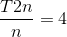
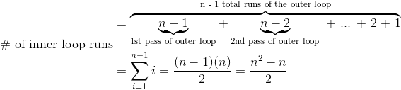
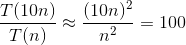
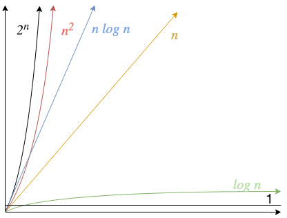
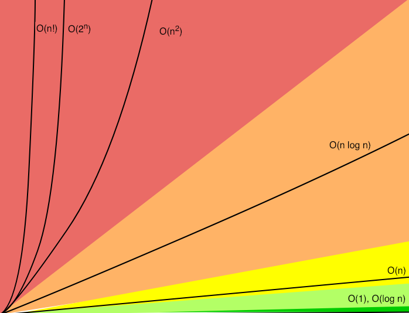

Time complexity is written _T(n)_ and gives the number of operations performed when processing input of size _n_ - we also refer to it as "running cost". If a function is quadratic (n<sup>2</sup>), we can predict how much longer it takes to run with double the input using 

When an algorithm can have different values of _T(n)_ for the same value of _n_, we use cases:

- _Best Case_ - When input requires minimum number of operations for any input of that size. For sorting, this is usually the case for already sorted input.
- _Average Case_ - Average number of operations for input of a given _n_. For sorting, an input in random order is usually considered.
- _Worst Case_ - When input requires maximum number of operations for input of a given size. In many sorting algorithms, that's when the input is given in reverse order.

In general, we care about the worst case. This gives a guaranteed baseline that we can count on.

## 2.1 Counting Time

Let's use Selection Sort as an example for how to calculate time complexity. In Selection Sort, an outer loop updates the current position being sorted and an inner loop selects the items that goes in the current position

```
function selection_sort(list)
    for current <- 1 ... list.length - 1
        smallest <- current
        for i <- current + 1 ... list.length
            if list[i] < list[smallest]
                smallest <- i
            list.swap_items(current, smallest)
```

The outer loop runs _n - 1_ times and does two operations per run (one assignment and one swap), totalling _2n - 2_ operations. The inner loop first runs _n - 1_ times, then _n - 2_ times, then _n - 3_ times, etc.


In the worst case, the _if_ condition is always met, so the inner loop does one comparison and one assignment _(n<sup>2 - n)/2_ times, hence _n<sup>2</sup> - n_ operations. The algorithm costs _2n - 2_ operations for the outer loop and _n<sup>2</sup> - n_ for the inner loop. Because constants are ignored, the time complexity is _T(n) = n<sup>2</sup> + n - 2_. In terms of Big O, we can round to _n<sup>2</sup>_ because _n<sup>2</sup>_ is the dominant term.

### Understanding Growth

To predict how execution time will grow, you don't need to know all the terms of _T(n)_. You can approximate by taking the fastest-growing or dominant term.

#### Index Cards:

_Problem_: Yesterday, you spilled a box of index cards and it took you two hours of sorting to put the items in the correct order. Today, you knocked over 10 boxes. How much time do you need to fix your greivous error?

_Solution_:


## 2.2 Big O Notation:

Big O Notation is a special notation referring to the classes of growth and is used for expressing the dominant term of an algorithm cost function in the worst case.

When designing, it's important to anticipate the most frequent operations necessary to your algorithm and to figure out the best data structure to use that may minimize the cost of such operations.

**Graph I made to represent some Big O notations**


**Another graph**


## 2.3 Exponentials:

O(2<sup>n</sup>) is known as _exponential time_. Functions written in exponential time grow so quickly, they're considered not runnable as they work for few input types and require a lot of computing power if inputs aren't tiny.

Some algorithms are worse even than exponential, such as _factorial time_ algorithms _(n!)_.

## 2.4 Counting Memory

The measurement of the amount of working storage an algorithm needs is called _space complexity_. We measure space complexity in much the same way we measure time complexity, but count memory rather than computing operations. Usually have to make a trade off between have a good space complexity or having a good time complexity.
