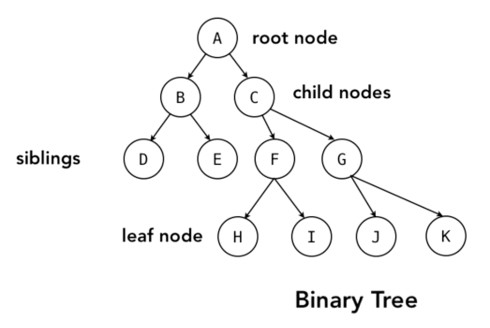
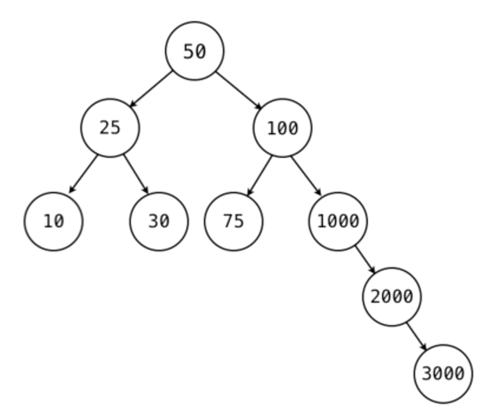

## Introduction:

**Data Structure** - An intentional arrangement of data

We naturally think in collections of information.

A recipe is a data structure, as is a shopping list, a flight schedule, bank statement, etc.

Focus of this course is data structures created and held in memory in a running computer program.

## Data Structures

Basic need for data structure: Want to enforce systematic organization, group variables together and treat it as one item

In computer science:

- **Record** - is a value that itself contains other values (contains fields)
- **Field** - single piece of information within a record

In math:

- **tuple** - grouped sequence of elements

How do we implement records/fields/tuples in a programming language?

## Using C-Style structs

```
// define the struct
struct Book {
string title;
double price;
bool isPublished;
bool isHardback;
};

// create a variable with that struct type
Book first;

// set member variables
first.title = "Dark and Stormy Night";
first.price = 12.95
first.isPublished = true;
first.isHardback = false;
```

What's the difference between a struct and a class?

<style type="text/css">
.tg  {border-collapse:collapse;border-spacing:0;}
.tg td{font-family:Arial, sans-serif;font-size:14px;padding:10px 5px;border-style:solid;border-width:1px;overflow:hidden;word-break:normal;border-color:black;}
.tg th{font-family:Arial, sans-serif;font-size:14px;font-weight:normal;padding:10px 5px;border-style:solid;border-width:1px;overflow:hidden;word-break:normal;border-color:black;}
.tg .tg-baqh{text-align:center;vertical-align:top}
.tg .tg-c3ow{border-color:inherit;text-align:center;vertical-align:top}
</style>

<pre>
<div class="table">
<table class="tg">
  <tr>
    <th class="tg-c3ow">struct</th>
    <th class="tg-c3ow">class</th>
  </tr>
  <tr>
    <td class="tg-baqh">only data - no behavior</td>
    <td class="tg-baqh">behavior and data</td>
  </tr>
  <tr>
    <td class="tg-baqh">simple creation</td>
    <td class="tg-baqh">explicit instantiation (new, alloc)</td>
  </tr>
  <tr>
    <td class="tg-baqh">value types</td>
    <td class="tg-baqh">reference types</td>
  </tr>
  <tr>
    <td class="tg-baqh">no object-oriented-features</td>
    <td class="tg-baqh">polymorphism, inheritance, etc.</td>
  </tr>
  <tr>
    <td class="tg-baqh">"Plain Old Data Structure" (PODS)</td>
    <td class="tg-baqh"></td>
  </tr>
</table>
</div>
</pre>

## Plain Old Data Structure: Examples

```
struct Point {
    int x;
    int y;
};

Point startPosition;
startPosition.x = 50
startPosition.y = 50;

Point finishPosition;
finishPosition.x = 500;
finishPosition.y = 100;

myObject.animate(startPosition, finishPosition);
```

```
struct Color {
    int red;
    int green;
    int blue;
    int alpha;
};

Color backgroundColor;
backgroundColor.red = 255;
backgroundColor.green = 0;
backgroundColor.blue = 0;
backgroundColor.alpha = 255;

myWindow.setBackground(backgroundColor);
```

## Language support for structs

<style type="text/css">
.tg  {border-collapse:collapse;border-spacing:0;}
.tg td{font-family:Arial, sans-serif;font-size:14px;padding:10px 5px;border-style:solid;border-width:1px;overflow:hidden;word-break:normal;border-color:black;}
.tg th{font-family:Arial, sans-serif;font-size:14px;font-weight:normal;padding:10px 5px;border-style:solid;border-width:1px;overflow:hidden;word-break:normal;border-color:black;}
.tg .tg-0pky{border-color:inherit;text-align:left;vertical-align:top}
.tg .tg-0lax{text-align:left;vertical-align:top}
</style>
<pre>
<div class="table">
<table class="tg">
  <tr>
    <th class="tg-0pky">Language</th>
    <th class="tg-0pky">Support</th>
  </tr>
  <tr>
    <td class="tg-0lax">Objective-C</td>
    <td class="tg-0lax">As in C, used in many Apple frameworks</td>
  </tr>
  <tr>
    <td class="tg-0lax">C# /other .NET</td>
    <td class="tg-0lax">Also allows basic behavior to be added</td>
  </tr>
  <tr>
    <td class="tg-0lax">Java</td>
    <td class="tg-0lax">Do not exist - closest equivalent is lightweight class</td>
  </tr>
  <tr>
    <td class="tg-0lax">Python</td>
    <td class="tg-0lax">Do not exist</td>
  </tr>
  <tr>
    <td class="tg-0lax">Ruby</td>
    <td class="tg-0lax">Exist, though implemented as lightweight class</td>
  </tr>
</table>
</div>
</pre>

## Array

- Ordered collection of items, multiple independent values contained in one named container
- Most commonly used data structure
- Support for simple arrays is usually built in
- Each element has an index
- You can get to any element knowing its index

### Simple Arrays:

- Usually, 0-based integer index
- Fixed size (immutable)
- Specific data type

Misconception: Simple Arrays are just from the olden days, should use dynamic arrays without data restrictions if you can.

- The more constraints you can put in place, the faster and smaller your data structure is able to be

_Flexibility introduces overhead_

### Using Multidimensional Arrays (Matrix/Table)

Access elements (row index, column index)
Useful for representing real-world situations

- Example: temperature readings (day/hours), chess board
  If you understand the idea of a cell phone bill for a multi-person family plan, you can grasp a multi-dimensional array

## Using Jagged Arrays

Choosing to do a little more work up front to allow logic to not have to be added later
Having internal arrays of differing sizes
Example: If you need to represent days in a month, there are varying numbers of days in a month

Pseudocode:

```
int[][] ticketSales = new int[12][]
for each month in ticketSales
    if april, june, september, november
        create array of 30 elements
    else if february and leap year
        create array of 29 elements
    else if february and not leap year
        create array of 28 elements
    else
        create array of 31 elements
    end if
    add array to ticketSales[month]
end for
```

## Resizeable (Dynamic, Mutable) Arrays

### Simple fixed-size arrays: Java

```
String[] fixedArray = new String[3];

fixedArray[0] = "This";
fixedArray[1] = "Cannot";
fixedArray[2] = "Grow";
```

### Resizable arrays: Java

```
// need to import
import java.util.*;

// create arraylist of strings
List<String> resizeable = new ArrayList<String>();

resizeable.add("This");
resizeable.add("Is");
resizeable.add("Resizeable");
```

### Fixed arrays: Objective-C

```
//NSArray used for arrays of objects - fixed size
NSArray \*myFiexedArray = @[@"one", @"two", @"three"];
```

### Resizeable arrays: Objective-C

```
// NSMutableArray is the resizeable version
NSMutableArray *resizeable = [[NSMutableArray alloc]init];

[resizeable addObject:@"one"];
[resizeable addObject:@"two"];
[resizeable addObject:@"three"];
```

### Adding new elements: location?

- Adding an element at the end is easier, faster, and takes less work
- Adding anywhere else requires moving other elements around
  - Just because something is happening in the background doesn't mean you can ignore that it's happening

## Appending items at the end of the array

<style type="text/css">
.tg  {border-collapse:collapse;border-spacing:0;}
.tg td{font-family:Arial, sans-serif;font-size:14px;padding:10px 5px;border-style:solid;border-width:1px;overflow:hidden;word-break:normal;border-color:black;}
.tg th{font-family:Arial, sans-serif;font-size:14px;font-weight:normal;padding:10px 5px;border-style:solid;border-width:1px;overflow:hidden;word-break:normal;border-color:black;}
.tg .tg-0pky{border-color:inherit;text-align:left;vertical-align:top}
.tg .tg-0lax{text-align:left;vertical-align:top}
</style>
<pre>
<div class="table">
<table class="tg">
  <tr>
    <th class="tg-0pky">Language</th>
    <th class="tg-0pky">Method</th>
  </tr>
  <tr>
    <td class="tg-0lax">Java</td>
    <td class="tg-0lax">add(value)</td>
  </tr>
  <tr>
    <td class="tg-0lax">Objective-C</td>
    <td class="tg-0lax">addObject:value</td>
  </tr>
  <tr>
    <td class="tg-0lax">JavaScript</td>
    <td class="tg-0lax">push(value)</td>
  </tr>
  <tr>
    <td class="tg-0lax">Ruby</td>
    <td class="tg-0lax">push(value)</td>
  </tr>
  <tr>
    <td class="tg-0lax">Python</td>
    <td class="tg-0lax">append(value)</td>
  </tr>
</table>
</div>
</pre>

## Inserting items at a specific index

<style type="text/css">
.tg  {border-collapse:collapse;border-spacing:0;}
.tg td{font-family:Arial, sans-serif;font-size:14px;padding:10px 5px;border-style:solid;border-width:1px;overflow:hidden;word-break:normal;border-color:black;}
.tg th{font-family:Arial, sans-serif;font-size:14px;font-weight:normal;padding:10px 5px;border-style:solid;border-width:1px;overflow:hidden;word-break:normal;border-color:black;}
.tg .tg-0pky{border-color:inherit;text-align:left;vertical-align:top}
.tg .tg-0lax{text-align:left;vertical-align:top}
</style>
<pre>
<div class="table">
<table class="tg">
  <tr>
    <th class="tg-0pky">Language</th>
    <th class="tg-0pky">Method</th>
  </tr>
  <tr>
    <td class="tg-0lax">Java</td>
    <td class="tg-0lax">add(index, value)</td>
  </tr>
  <tr>
    <td class="tg-0lax">Objective-C</td>
    <td class="tg-0lax">addObject:value atIndex:index</td>
  </tr>
  <tr>
    <td class="tg-0lax">JavaScript</td>
    <td class="tg-0lax">splice(index, items_to_remove, items_to_insert)</td>
  </tr>
  <tr>
    <td class="tg-0lax">Ruby</td>
    <td class="tg-0lax">insert(index, value)</td>
  </tr>
  <tr>
    <td class="tg-0lax">Python</td>
    <td class="tg-0lax">insert(index, value)</td>
  </tr>
</table>
</div>
</pre>

## Removing items from an array

<style type="text/css">
.tg  {border-collapse:collapse;border-spacing:0;}
.tg td{font-family:Arial, sans-serif;font-size:14px;padding:10px 5px;border-style:solid;border-width:1px;overflow:hidden;word-break:normal;border-color:black;}
.tg th{font-family:Arial, sans-serif;font-size:14px;font-weight:normal;padding:10px 5px;border-style:solid;border-width:1px;overflow:hidden;word-break:normal;border-color:black;}
.tg .tg-0pky{border-color:inherit;text-align:left;vertical-align:top}
.tg .tg-0lax{text-align:left;vertical-align:top}
</style>

<pre>
<div class="table">
<table class="tg">
  <tr>
    <th class="tg-0pky">Language</th>
    <th class="tg-0pky">Method</th>
  </tr>
  <tr>
    <td class="tg-0lax">Java</td>
    <td class="tg-0lax">remove(index)</td>
  </tr>
  <tr>
    <td class="tg-0lax">Objective-C</td>
    <td class="tg-0lax">removeObjectAtIndex:index</td>
  </tr>
  <tr>
    <td class="tg-0lax">JavaScript</td>
    <td class="tg-0lax">pop / slice</td>
  </tr>
  <tr>
    <td class="tg-0lax">Ruby</td>
    <td class="tg-0lax">pop / delete_at</td>
  </tr>
  <tr>
    <td class="tg-0lax">Python</td>
    <td class="tg-0lax">pop / remove</td>
  </tr>
</table>
</div>
</pre>

## Five requirements of any data structure

- How to **Access** (one item/ all items)
- How to **Insert** (at end/ at position)
- How to **Delete** (from end/ from position)
- How to **Find** (if exists/ what location)
- How to **Sort** (sort in place/ created sorted version)

Often won't get all five

- Most won't support search
- Many don't provide sorting behavior (others are naturally sorted and keep themselves organized)

## Sorting Arrays

Will typically use the sort built in to the language because it's battle-tested

Built-in sorting tends to look at the length of the array in order to figure out what implementation to use

Most languages will attempt to sort in-place

There are a few that create a sorted copy of the array

Need to understand which one your language is doing

Sorting is always computationally intensive - keeping conscious of how much data you have and how often you need it sorted may lead you to changing data structure

## Sorting Custom Objects

If you have an array of objects with multiple pieces of data, you want to control how that's sorted

Will need to provide a little bit of logic, comparator or compare function

Sorting is hard, comparing is easy

### Example Comparator/ Compare Function:

```
PseudoCompare (Employee a, Employee b)
    if a.lastName < b.lastname return -1 // less than
    if a.lastname > b.lastname return 1 // greater than
    if a.lastname == b.lastname
        if a.firstname < b.firstname return -1 // less than
        if a.firstname > b.firstname return 1 // greater than
        if a.firstname == b.firstname return 0 // equal
    end if
end
```

## Searching Arrays

### Linear (sequential) search: O(n) complexity

```
set i to 0
while i < array.length
    if array[i] == 99
        return true
    end if
    add 1 to i
end while
return false
```

Best case: element at [0]
Worst case: Not in array

If you have a simple array and the items can be in any order, a linear search may be what you have to do.

If there's no predictable order, no other option than to check all the items

If the array is ordered, there are better ways of searching

If searching is something you're going to want to do, having an order may be important

Asking a data structure to sort is computationally demanding.

- May settle for a slow search because it is less computationally exhaustive than keeping sort

## Using built-in search behavior

```
if (myArray.contains(99) ) {
    log("Yes, it exists")
}
```

```
// for specific location
int result = myArray.indexOf(99);

if ( result != -1) {
    log ("The value is located at position: " + result);
} else {
    log ("The object is not in the array")
end if
```

## Searching for existence / location

<style type="text/css">
.tg  {border-collapse:collapse;border-spacing:0;}
.tg td{font-family:Arial, sans-serif;font-size:14px;padding:10px 5px;border-style:solid;border-width:1px;overflow:hidden;word-break:normal;border-color:black;}
.tg th{font-family:Arial, sans-serif;font-size:14px;font-weight:normal;padding:10px 5px;border-style:solid;border-width:1px;overflow:hidden;word-break:normal;border-color:black;}
.tg .tg-0pky{border-color:inherit;text-align:left;vertical-align:top}
.tg .tg-0lax{text-align:left;vertical-align:top}
</style>
<pre>
<div class="table">
<table class="tg">
  <tr>
    <th class="tg-0pky">Language</th>
    <th class="tg-0pky">Method for existence</th>
    <th class="tg-0lax">Method for location</th>
  </tr>
  <tr>
    <td class="tg-0lax">Java</td>
    <td class="tg-0lax">contains</td>
    <td class="tg-0lax">indexOf</td>
  </tr>
  <tr>
    <td class="tg-0lax">Objective-C</td>
    <td class="tg-0lax">containsObject</td>
    <td class="tg-0lax">indexOfObject</td>
  </tr>
  <tr>
    <td class="tg-0lax">JavaScript</td>
    <td class="tg-0lax"></td>
    <td class="tg-0lax">indexOf</td>
  </tr>
  <tr>
    <td class="tg-0lax">Ruby</td>
    <td class="tg-0lax"></td>
    <td class="tg-0lax">index / find_index</td>
  </tr>
  <tr>
    <td class="tg-0lax">Python</td>
    <td class="tg-0lax"></td>
    <td class="tg-0lax">index</td>
  </tr>
  <tr>
    <td class="tg-0lax">C#</td>
    <td class="tg-0lax">contains</td>
    <td class="tg-0lax">indexOf</td>
  </tr>
</table>
</div>
</pre>

## Binary Searching

If the values in your array are in descending or ascending order

- Calculate midpoint of list rounded down
- Check if value we're searching for is at the midpoint
- If not:
  - If number at midpoint is lower than the value searching for, can ignore indexes following it
    - Advance upper index to midpoint, calculate new midpoint
  - If number at midpoint is higher than the value searching for, can ignore indexes preceding it
    - Advance lower index to midpoint, calculate new midpoint

## Binary Searching - Language Support

<style type="text/css">
.tg  {border-collapse:collapse;border-spacing:0;}
.tg td{font-family:Arial, sans-serif;font-size:14px;padding:10px 5px;border-style:solid;border-width:1px;overflow:hidden;word-break:normal;border-color:black;}
.tg th{font-family:Arial, sans-serif;font-size:14px;font-weight:normal;padding:10px 5px;border-style:solid;border-width:1px;overflow:hidden;word-break:normal;border-color:black;}
.tg .tg-0pky{border-color:inherit;text-align:left;vertical-align:top}
.tg .tg-0lax{text-align:left;vertical-align:top}
</style>

<pre>
<div class="table">
<table class="tg">
  <tr>
    <th class="tg-0pky">Language</th>
    <th class="tg-0pky">Method</th>
  </tr>
  <tr>
    <td class="tg-0lax">Java</td>
    <td class="tg-0lax">binarySearch</td>
  </tr>
  <tr>
    <td class="tg-0lax">C#</td>
    <td class="tg-0lax">Array.BinarySearch</td>
  </tr>
  <tr>
    <td class="tg-0lax">JavaScript</td>
    <td class="tg-0lax">n/a</td>
  </tr>
  <tr>
    <td class="tg-0lax">Ruby</td>
    <td class="tg-0lax">bsearch</td>
  </tr>
  <tr>
    <td class="tg-0lax">C++</td>
    <td class="tg-0lax">binary_search</td>
  </tr>
  <tr>
    <td class="tg-0lax">Objective-C</td>
    <td class="tg-0lax">indexOfObject:inSortedRange:</td>
  </tr>
</table>
</div>
</pre>

Although binary search is great for sorted array, we'll see it again going forward because it's not just useful for arrays

## Lists

In Python, fundamental data type

In Java, list is an interface (abstract definition)

In Objective-C, programmers write it themselves

In Ruby, unlikely to talk about lists

Both arrays and lists are collections (ways to collect items into one group with a name)

## Understanding Lists

If arrays are about direct access, lists are about sequential access.

Structure does not have strict numeric index

Elements can be stored anywhere in memory

When you access a list, you get the first element (first node).

A list node is a simple wrapper object (struct) that holds the element and the link to the next node.

Last element contains a terminal/sentinel node or null reference

Downside, have to access elements sequentially

### Adding / Removing Elements

While adding/removing in the middle of an array requires moving everything past that element

To add a node at the start of a list, create a new node and point it to the previous start of the list

To add to the end, create a node at the end of the list, pointing the previous end of the list to the new node.

Removing is just as easy, changing pointers.

## Comparison of Arrays and Linked Lists

<style type="text/css">
.tg  {border-collapse:collapse;border-spacing:0;}
.tg td{font-family:Arial, sans-serif;font-size:14px;padding:10px 5px;border-style:solid;border-width:1px;overflow:hidden;word-break:normal;border-color:black;}
.tg th{font-family:Arial, sans-serif;font-size:14px;font-weight:normal;padding:10px 5px;border-style:solid;border-width:1px;overflow:hidden;word-break:normal;border-color:black;}
.tg .tg-baqh{text-align:center;vertical-align:top}
.tg .tg-c3ow{border-color:inherit;text-align:center;vertical-align:top}
</style>
<pre>
<div class="table">
<table class="tg">
  <tr>
    <th class="tg-c3ow"></th>
    <th class="tg-c3ow">Arrays</th>
    <th class="tg-baqh">Linked Lists</th>
  </tr>
  <tr>
    <td class="tg-baqh">Direct Access</td>
    <td class="tg-baqh">**Good**<br>fixed time O(1)</td>
    <td class="tg-baqh">**Poor**<br>linear time O(n)</td>
  </tr>
  <tr>
    <td class="tg-baqh">Adding/Removing</td>
    <td class="tg-baqh">**Poor**<br>linear time O(n)</td>
    <td class="tg-baqh">**Good**<br>fixed time O(1)</td>
  </tr>
  <tr>
    <td class="tg-baqh">Searching</td>
    <td class="tg-baqh">O(n) linear search <br>O(log n) binary search</td>
    <td class="tg-baqh">O(n) linear search</td>
  </tr>
</table>
</div>
</pre>

## Linked Lists

Singly linked lists - reference to next node

Doubly linked lists - reference to previous and next node

Circular doubly linked list - last element points to first element, first element's previous is last element

## Lists in Languages

Java - interface (describes behavior that another class can implement)

- Class LinkedList is a doubly-linked-list implementation
- Operations that index into the list will traverse the list from the beginning to the end or the end, whichever is closer to the specific index.

## Language Support for Linked Lists

<style type="text/css">
.tg  {border-collapse:collapse;border-spacing:0;}
.tg td{font-family:Arial, sans-serif;font-size:14px;padding:10px 5px;border-style:solid;border-width:1px;overflow:hidden;word-break:normal;border-color:black;}
.tg th{font-family:Arial, sans-serif;font-size:14px;font-weight:normal;padding:10px 5px;border-style:solid;border-width:1px;overflow:hidden;word-break:normal;border-color:black;}
.tg .tg-0pky{border-color:inherit;text-align:left;vertical-align:top}
.tg .tg-0lax{text-align:left;vertical-align:top}
</style>

<pre>
<div class="table">
<table class="tg">
  <tr>
    <th class="tg-0pky">Language</th>
    <th class="tg-0pky">Support</th>
  </tr>
  <tr>
    <td class="tg-0lax">Java</td>
    <td class="tg-0lax">LinkedList in java.util</td>
  </tr>
  <tr>
    <td class="tg-0lax">C#</td>
    <td class="tg-0lax">LinkedList in System.Collections.Generic</td>
  </tr>
  <tr>
    <td class="tg-0lax">Objective-C</td>
    <td class="tg-0lax">n/a</td>
  </tr>
  <tr>
    <td class="tg-0lax">Ruby</td>
    <td class="tg-0lax">n/a</td>
  </tr>
  <tr>
    <td class="tg-0lax">Python</td>
    <td class="tg-0lax">n/a - "lists" are dynamic arrays, **not** linked lists</td>
  </tr>
  <tr>
    <td class="tg-0lax">C++</td>
    <td class="tg-0lax">std::list</td>
  </tr>
</table>
</div>
</pre>

## Stacks

Last element added to the stack is the first one out (LIFO/FILO)

Things you can do with a stack:

- Push items onto the stack
- Pop items off and return
- Peek() - look at last element added to stack without removing

## Language Support for Stacks

<style type="text/css">
.tg  {border-collapse:collapse;border-spacing:0;}
.tg td{font-family:Arial, sans-serif;font-size:14px;padding:10px 5px;border-style:solid;border-width:1px;overflow:hidden;word-break:normal;border-color:black;}
.tg th{font-family:Arial, sans-serif;font-size:14px;font-weight:normal;padding:10px 5px;border-style:solid;border-width:1px;overflow:hidden;word-break:normal;border-color:black;}
.tg .tg-0pky{border-color:inherit;text-align:left;vertical-align:top}
.tg .tg-0lax{text-align:left;vertical-align:top}
</style>

<pre>
<div class="table">
<table class="tg">
  <tr>
    <th class="tg-0pky">Language</th>
    <th class="tg-0pky">Support</th>
  </tr>
  <tr>
    <td class="tg-0lax">Java</td>
    <td class="tg-0lax">Stack (push / pop / peek)</td>
  </tr>
  <tr>
    <td class="tg-0lax">C#</td>
    <td class="tg-0lax">Stack (Push / Pop / Peek)</td>
  </tr>
  <tr>
    <td class="tg-0lax">Objective-C</td>
    <td class="tg-0lax">use NSMutableArray</td>
  </tr>
  <tr>
    <td class="tg-0lax">Ruby</td>
    <td class="tg-0lax">use Array (push / pop)</td>
  </tr>
  <tr>
    <td class="tg-0lax">Python</td>
    <td class="tg-0lax">use lists (append / pop)</td>
  </tr>
  <tr>
    <td class="tg-0lax">C++</td>
    <td class="tg-0lax">std::stack (push / pop)</td>
  </tr>
</table>
</div>
</pre>

## Abstract Data Types

Stacks and Queues

- Has expected, defined behavior
- Implementation is abstracted away
- Could be implemented behind the scenes using a dynamic array
- Could also be implemented behind the scenes using a linked list

Abstract data types are not the same as an abstract class

## Using Queues

First element in is the first element out (FIFO)

Sending jobs to a printer is an example of a queue

Used in multithreading and concurrency situations

## Language Support for Queue

<style type="text/css">
.tg  {border-collapse:collapse;border-spacing:0;}
.tg td{font-family:Arial, sans-serif;font-size:14px;padding:10px 5px;border-style:solid;border-width:1px;overflow:hidden;word-break:normal;border-color:black;}
.tg th{font-family:Arial, sans-serif;font-size:14px;font-weight:normal;padding:10px 5px;border-style:solid;border-width:1px;overflow:hidden;word-break:normal;border-color:black;}
.tg .tg-0pky{border-color:inherit;text-align:left;vertical-align:top}
.tg .tg-0lax{text-align:left;vertical-align:top}
</style>

<pre>
<div class="table">
<table class="tg">
  <tr>
    <th class="tg-0pky">Language</th>
    <th class="tg-0pky">Support</th>
  </tr>
  <tr>
    <td class="tg-0lax">Java</td>
    <td class="tg-0lax">LinkedList (add / remove)</td>
  </tr>
  <tr>
    <td class="tg-0lax">C#</td>
    <td class="tg-0lax">Queue (enqueue / dequeue)</td>
  </tr>
  <tr>
    <td class="tg-0lax">Objective-C</td>
    <td class="tg-0lax">NSMutableArray (addObject / removeObjectAtIndex:0)</td>
  </tr>
  <tr>
    <td class="tg-0lax">Ruby</td>
    <td class="tg-0lax">use Array (push / shift)</td>
  </tr>
  <tr>
    <td class="tg-0lax">Python</td>
    <td class="tg-0lax">queue (put / get)</td>
  </tr>
  <tr>
    <td class="tg-0lax">C++</td>
    <td class="tg-0lax">std::queue (push_back / pop_front)</td>
  </tr>
</table>
</div>
</pre>

## Priority Queues

Typically requires a comparator or compare function

Allows you to add elements to the array that can be moved closer to the front of the queue if they have a higher priority than the elements already in the queue.

## Language Support for Priority Queues

<style type="text/css">
.tg  {border-collapse:collapse;border-spacing:0;}
.tg td{font-family:Arial, sans-serif;font-size:14px;padding:10px 5px;border-style:solid;border-width:1px;overflow:hidden;word-break:normal;border-color:black;}
.tg th{font-family:Arial, sans-serif;font-size:14px;font-weight:normal;padding:10px 5px;border-style:solid;border-width:1px;overflow:hidden;word-break:normal;border-color:black;}
.tg .tg-0pky{border-color:inherit;text-align:left;vertical-align:top}
.tg .tg-0lax{text-align:left;vertical-align:top}
</style>
<pre>
<div class="table">
<table class="tg">
  <tr>
    <th class="tg-0pky">Language</th>
    <th class="tg-0pky">Support</th>
  </tr>
  <tr>
    <td class="tg-0lax">Java</td>
    <td class="tg-0lax">PriorityQueue</td>
  </tr>
  <tr>
    <td class="tg-0lax">C#</td>
    <td class="tg-0lax">n/a</td>
  </tr>
  <tr>
    <td class="tg-0lax">Objective-C</td>
    <td class="tg-0lax">CFBinaryHeap</td>
  </tr>
  <tr>
    <td class="tg-0lax">Ruby</td>
    <td class="tg-0lax">n/a</td>
  </tr>
  <tr>
    <td class="tg-0lax">Python</td>
    <td class="tg-0lax">n/a</td>
  </tr>
  <tr>
    <td class="tg-0lax">C++</td>
    <td class="tg-0lax">std::priority_queue</td>
  </tr>
</table>
</div>
</pre>

NOTE:
Course says n/a for Python, but Python website indicates there is a PriorityQueue class:

[Priority Queue](https://docs.python.org/3.7/library/asyncio-queue.html?highlight=priority%20queue) <br />
class asyncio.PriorityQueue <br />A variant of Queue; retrieves entries in priority order (lowest first). <br />Entries are typically tuples of the form (priority_number, data).

## Using a Deque (Double-ended queue)

Can add to either end

Can remove from front or end

Can behave like a stack or a queue

**Caution** Deque (specialized kind of queue) vs. Dequeue (method to remove item from queue)

## Language Support for Deque

<style type="text/css">
.tg  {border-collapse:collapse;border-spacing:0;}
.tg td{font-family:Arial, sans-serif;font-size:14px;padding:10px 5px;border-style:solid;border-width:1px;overflow:hidden;word-break:normal;border-color:black;}
.tg th{font-family:Arial, sans-serif;font-size:14px;font-weight:normal;padding:10px 5px;border-style:solid;border-width:1px;overflow:hidden;word-break:normal;border-color:black;}
.tg .tg-0pky{border-color:inherit;text-align:left;vertical-align:top}
.tg .tg-0lax{text-align:left;vertical-align:top}
</style>

<pre>
<div class="table">
<table class="tg">
  <tr>
    <th class="tg-0pky">Language</th>
    <th class="tg-0pky">Support</th>
  </tr>
  <tr>
    <td class="tg-0lax">Java</td>
    <td class="tg-0lax">LinkedList implements Deque</td>
  </tr>
  <tr>
    <td class="tg-0lax">C#</td>
    <td class="tg-0lax">n/a - use LinkedList for equivalent</td>
  </tr>
  <tr>
    <td class="tg-0lax">Objective-C</td>
    <td class="tg-0lax">n/a - use NSMutableArray</td>
  </tr>
  <tr>
    <td class="tg-0lax">Ruby</td>
    <td class="tg-0lax">n/a - use Array</td>
  </tr>
  <tr>
    <td class="tg-0lax">Python</td>
    <td class="tg-0lax">collections.deque</td>
  </tr>
  <tr>
    <td class="tg-0lax">C++</td>
    <td class="tg-0lax">std::deque</td>
  </tr>
</table>
</div>
</pre>

## Associative Arrays

- Pairs of keys and values
- Keys must be unique, values do not have to be
- Keys do not need to be in order
- Values can be objects
- Common to use a string as a key, but can use any type

## Language Support for Associative Arrays

<style type="text/css">
.tg  {border-collapse:collapse;border-spacing:0;}
.tg td{font-family:Arial, sans-serif;font-size:14px;padding:10px 5px;border-style:solid;border-width:1px;overflow:hidden;word-break:normal;border-color:black;}
.tg th{font-family:Arial, sans-serif;font-size:14px;font-weight:normal;padding:10px 5px;border-style:solid;border-width:1px;overflow:hidden;word-break:normal;border-color:black;}
.tg .tg-0pky{border-color:inherit;text-align:left;vertical-align:top}
.tg .tg-0lax{text-align:left;vertical-align:top}
</style>

<pre>
<div class="table">
<table class="tg">
  <tr>
    <th class="tg-0pky">Language</th>
    <th class="tg-0pky">Support</th>
  </tr>
  <tr>
    <td class="tg-0lax">Java</td>
    <td class="tg-0lax">HashMap, HashTable</td>
  </tr>
  <tr>
    <td class="tg-0lax">C#</td>
    <td class="tg-0lax">Hashtable, Dictionary</td>
  </tr>
  <tr>
    <td class="tg-0lax">Objective-C</td>
    <td class="tg-0lax">NSDictionary</td>
  </tr>
  <tr>
    <td class="tg-0lax">Ruby</td>
    <td class="tg-0lax">Hash</td>
  </tr>
  <tr>
    <td class="tg-0lax">Python</td>
    <td class="tg-0lax">dict</td>
  </tr>
  <tr>
    <td class="tg-0lax">C++</td>
    <td class="tg-0lax">std::unordered_map</td>
  </tr>
  <tr>
    <td class="tg-0lax">Javascript</td>
    <td class="tg-0lax">objects</td>
  </tr>
</table>
</div>
</pre>

Behind the scenes, most associative arrays are implemented using a hash table

To understand a hash table, we first need to understand a hash.

## Hash

A way to take data, run it through a hash function that will manipulate that data and output a short, simplified reference generated from that data

## Hashing is not encryption

Hashing functions are typically one-way

- Not invertible

Information is lost when hashing

## Hash Function Example

```
Public Class Person {
    String firstname;
    String lastname;
    Data birthDate;

    @Override
    public int hashCode() {
        // code to add all numeric values
        // take letters in all the names, give them a 1-26 A-Z representation
        // add all those numbers up
        // take all the numbers in the date, add them up
        // add the numbers from the name to the numbers in the date
        // return number
        return hashvalue;
    }
}

/* Example:
Sam         // 19 1 13 (33) +
Jones       // 10 15 14 5 (44)
            // (77)
04/04/1990  // 04 04 1990 (1998)
            // hash: 2075
```

## Hashing Rules

- Hashing should be deterministic under the same context
- Two objects that are **equal** should return the same hash
- But the same hash _may_ also result from different objects

## Hashing Collision

When two objects result from different objects

## Why do this?

Being able to take a complex object and boil it down to a single integer representation is useful because you can use that hash value to get to a certain location.

## Hash Table

Typical way of implementing an associative array

Benefit over linked lists and arrays is speed

## Creating Hash Tables

Created with multiple empty buckets

Pass a key, value pair to hash table

- Will take key and run it through the hash function, getting an integer out
  - Depending on the hash table, may not use that integer, will reduce the number down related to the current size of the hash table so that it can attempt to evenly distribute the elements across however many buckets we have. (Could be as simple as using modulo)

When we need to get an object from the hash table, it can run it through the hash function and then access the element based on the index result of the hash function

## Managing Collisions

Separate chaining:

- Each bucket contains a collection like an array or linked list that can point to multiple entries

Other ways of managing collisions:

- Open-addressing
- Cuckoo hashing
- Hop-scotch
- Robin Hood

## Default Hash Behavior

<style type="text/css">
.tg  {border-collapse:collapse;border-spacing:0;}
.tg td{font-family:Arial, sans-serif;font-size:14px;padding:10px 5px;border-style:solid;border-width:1px;overflow:hidden;word-break:normal;border-color:black;}
.tg th{font-family:Arial, sans-serif;font-size:14px;font-weight:normal;padding:10px 5px;border-style:solid;border-width:1px;overflow:hidden;word-break:normal;border-color:black;}
.tg .tg-0pky{border-color:inherit;text-align:left;vertical-align:top}
.tg .tg-0lax{text-align:left;vertical-align:top}
</style>

<pre>
<div class="table">
<table class="tg">
  <tr>
    <th class="tg-0pky">Language</th>
    <th class="tg-0pky">Method</th>
  </tr>
  <tr>
    <td class="tg-0lax">Java</td>
    <td class="tg-0lax">hashCode()</td>
  </tr>
  <tr>
    <td class="tg-0lax">C#</td>
    <td class="tg-0lax">GetHashCode()</td>
  </tr>
  <tr>
    <td class="tg-0lax">Objective-C</td>
    <td class="tg-0lax">-hash</td>
  </tr>
  <tr>
    <td class="tg-0lax">Ruby</td>
    <td class="tg-0lax">hash()</td>
  </tr>
  <tr>
    <td class="tg-0lax">Python</td>
    <td class="tg-0lax">hash()</td>
  </tr>
  <tr>
    <td class="tg-0lax">C++</td>
    <td class="tg-0lax">std::hash</td>
  </tr>
</table>
</div>
</pre>

## Hashing in Custom Classes

Default equality behavior checks identity

Can be overridden to check internal state

If you override the equality of your class, you have to redefine hashing

- If two objects are _equal_ they must return the same hash

This behavior is already provided for string objects

## Language Support for Associative Arrays

<style type="text/css">
.tg  {border-collapse:collapse;border-spacing:0;}
.tg td{font-family:Arial, sans-serif;font-size:14px;padding:10px 5px;border-style:solid;border-width:1px;overflow:hidden;word-break:normal;border-color:black;}
.tg th{font-family:Arial, sans-serif;font-size:14px;font-weight:normal;padding:10px 5px;border-style:solid;border-width:1px;overflow:hidden;word-break:normal;border-color:black;}
.tg .tg-0pky{border-color:inherit;text-align:left;vertical-align:top}
.tg .tg-0lax{text-align:left;vertical-align:top}
</style>

<pre>
<div class="table">
<table class="tg">
  <tr>
    <th class="tg-0pky">Language</th>
    <th class="tg-0pky">Support</th>
  </tr>
  <tr>
    <td class="tg-0lax">Java</td>
    <td class="tg-0lax">HashTable, HashMap, ConcurrentHashMap</td>
  </tr>
  <tr>
    <td class="tg-0lax">C#</td>
    <td class="tg-0lax">Hashtable, StringDictionary, Dictionary&lt;&gt;, etc.</td>
  </tr>
  <tr>
    <td class="tg-0lax">Objective-C</td>
    <td class="tg-0lax">NSDictionary, NSMutableDictionary</td>
  </tr>
  <tr>
    <td class="tg-0lax">Ruby</td>
    <td class="tg-0lax">Hash</td>
  </tr>
  <tr>
    <td class="tg-0lax">Python</td>
    <td class="tg-0lax">dict</td>
  </tr>
  <tr>
    <td class="tg-0lax">C++</td>
    <td class="tg-0lax">std::unordered_map</td>
  </tr>
</table>
</div>
</pre>

## Working with Sets

A **set** is an unordered collection of objects

No index, sequence, or key

No duplicates (you cannot add the same object twice to the same set)

Designed for fast lookup (checking membership of a collection)

## Set Implementation with Hash Table

Key is the value

Checking membership, usually use a contains method

Would never use a set to index to a specific object and retrieve it

To go to any specific object in a set, already need the object

## Language Support for Sets

<style type="text/css">
.tg  {border-collapse:collapse;border-spacing:0;}
.tg td{font-family:Arial, sans-serif;font-size:14px;padding:10px 5px;border-style:solid;border-width:1px;overflow:hidden;word-break:normal;border-color:black;}
.tg th{font-family:Arial, sans-serif;font-size:14px;font-weight:normal;padding:10px 5px;border-style:solid;border-width:1px;overflow:hidden;word-break:normal;border-color:black;}
.tg .tg-0pky{border-color:inherit;text-align:left;vertical-align:top}
.tg .tg-0lax{text-align:left;vertical-align:top}
</style>

<pre>
<div class="table">
<table class="tg">
  <tr>
    <th class="tg-0pky">Language</th>
    <th class="tg-0pky">Support</th>
  </tr>
  <tr>
    <td class="tg-0lax">Java</td>
    <td class="tg-0lax">HashSet</td>
  </tr>
  <tr>
    <td class="tg-0lax">C#</td>
    <td class="tg-0lax">HashSet</td>
  </tr>
  <tr>
    <td class="tg-0lax">Objective-C</td>
    <td class="tg-0lax">NSSet, NSMutableSet</td>
  </tr>
  <tr>
    <td class="tg-0lax">Ruby</td>
    <td class="tg-0lax">Set</td>
  </tr>
  <tr>
    <td class="tg-0lax">Python</td>
    <td class="tg-0lax">set / frozenset</td>
  </tr>
  <tr>
    <td class="tg-0lax">C++</td>
    <td class="tg-0lax">std::set</td>
  </tr>
</table>
</div>
</pre>

In C++, sets are implemented not with hash tables but with binary search trees

## Tree Data Structure

As with linked list, there is a starting point of the tree structure

- Called root node

Root node could contain value, also contains next/child nodes

Child nodes contain next/child nodes

Child nodes with the same parent are called siblings

A node with no children is a leaf node



## Binary Search Tree(BST)

A sorted/ordered tree

A node can have 0 child nodes (leaf), 1, or 2.

Every node will have two links, left child and right child, which may point to another node or to null

A left child node must be less than its parent

A right child node must be more than its parent

## Binary Search Tree - Example



More nodes on right than left - Unbalanced BST

- Means you would have to perform more checks to add/remove/access nodes on the right than on the left

## Binary Search Tree Implementations

Self-Balancing algorithms include:

- Red-Black Trees
- AVL Trees
- Scapegoat Trees
- Splay Trees

## BST/ Hash Table Comparison

<style type="text/css">
.tg  {border-collapse:collapse;border-spacing:0;}
.tg td{font-family:Arial, sans-serif;font-size:14px;padding:10px 5px;border-style:solid;border-width:1px;overflow:hidden;word-break:normal;border-color:black;}
.tg th{font-family:Arial, sans-serif;font-size:14px;font-weight:normal;padding:10px 5px;border-style:solid;border-width:1px;overflow:hidden;word-break:normal;border-color:black;}
.tg .tg-0pky{border-color:inherit;text-align:left;vertical-align:top}
.tg .tg-0lax{text-align:left;vertical-align:top}
</style>

<pre>
<div class="table">
<table class="tg">
  <tr>
    <th class="tg-0pky">Binary Search Tree</th>
    <th class="tg-0pky">Hash Table</th>
  </tr>
  <tr>
    <td class="tg-0lax">Fast insertion, fast retrieval</td>
    <td class="tg-0lax">Fast insertion, fast retrieval</td>
  </tr>
  <tr>
    <td class="tg-0lax">Stays sorted - iterate elements in sequence</td>
    <td class="tg-0lax">Retrieval not guaranteed order</td>
  </tr>
</table>
</div>
</pre>

## BST - Language Support

<style type="text/css">
.tg  {border-collapse:collapse;border-spacing:0;}
.tg td{font-family:Arial, sans-serif;font-size:14px;padding:10px 5px;border-style:solid;border-width:1px;overflow:hidden;word-break:normal;border-color:black;}
.tg th{font-family:Arial, sans-serif;font-size:14px;font-weight:normal;padding:10px 5px;border-style:solid;border-width:1px;overflow:hidden;word-break:normal;border-color:black;}
.tg .tg-0pky{border-color:inherit;text-align:left;vertical-align:top}
.tg .tg-0lax{text-align:left;vertical-align:top}
</style>

<pre>
<div class="table">
<table class="tg">
  <tr>
    <th class="tg-0pky">Language</th>
    <th class="tg-0pky">Implementation</th>
  </tr>
  <tr>
    <td class="tg-0lax">Java</td>
    <td class="tg-0lax">TreeMap</td>
  </tr>
  <tr>
    <td class="tg-0lax">C#</td>
    <td class="tg-0lax">SortedDictionary</td>
  </tr>
  <tr>
    <td class="tg-0lax">Python</td>
    <td class="tg-0lax">n/a</td>
  </tr>
  <tr>
    <td class="tg-0lax">Ruby</td>
    <td class="tg-0lax">n/a</td>
  </tr>
  <tr>
    <td class="tg-0lax">Objective-C</td>
    <td class="tg-0lax">n/a</td>
  </tr>
  <tr>
    <td class="tg-0lax">C++</td>
    <td class="tg-0lax">std::set</td>
  </tr>
</table>
</div>
</pre>

## Heap Implementation

Heaps are a collection of objects

Items are always added top to bottom, left to right

Heaps are implemented as binary trees

## Min Heap or Max Heap?

Min heap: Lowest value at the top

- Rule: Child must always be larger than parent
  - At each insertion, if child is smaller, swaps with parent
  - Then checks if child is larger than new parent, swaps if not

Max heap: Highest value at the top

- Rule: Child must always be smaller than parent
  - At each insertion, if child is larger, swaps with parent
  - Then checks if child is smaller than new parent, swaps if not

A heap is not a fully sorted data structure

Good for implementing priority queue

## Language Support for Heap

<style type="text/css">
.tg  {border-collapse:collapse;border-spacing:0;}
.tg td{font-family:Arial, sans-serif;font-size:14px;padding:10px 5px;border-style:solid;border-width:1px;overflow:hidden;word-break:normal;border-color:black;}
.tg th{font-family:Arial, sans-serif;font-size:14px;font-weight:normal;padding:10px 5px;border-style:solid;border-width:1px;overflow:hidden;word-break:normal;border-color:black;}
.tg .tg-0pky{border-color:inherit;text-align:left;vertical-align:top}
.tg .tg-0lax{text-align:left;vertical-align:top}
</style>

<pre>
<div class="table">
<table class="tg">
  <tr>
    <th class="tg-0pky">Language</th>
    <th class="tg-0pky">Support</th>
  </tr>
  <tr>
    <td class="tg-0lax">Java</td>
    <td class="tg-0lax">PriorityQueue</td>
  </tr>
  <tr>
    <td class="tg-0lax">C#</td>
    <td class="tg-0lax">n/a</td>
  </tr>
  <tr>
    <td class="tg-0lax">Python</td>
    <td class="tg-0lax">heapq</td>
  </tr>
  <tr>
    <td class="tg-0lax">Ruby</td>
    <td class="tg-0lax">n/a</td>
  </tr>
  <tr>
    <td class="tg-0lax">Objective-C</td>
    <td class="tg-0lax">CFBinaryHeap</td>
  </tr>
  <tr>
    <td class="tg-0lax">C++</td>
    <td class="tg-0lax">std::priority_queue</td>
  </tr>
</table>
</div>
</pre>

## Introduction to Graphs

Collection of nodes where any node can connect to any other node

Any time you need to describe a complex system of interconnected points

## Graphs: Terminology

Vertices (nodes) <br />
Links (Edges) <br />
Directed - connections are one-way <br />
Undirected - connections are two-way <br />
Weighted graphs - associating a number with the connection of two vertices <br />

## Graph Implementations

- Singly Linked lists -> directed graphs
- Doubly Linked Lists -> undirected graphs
- Trees
- Heaps

## Recap

When thinking about data structures, think about the data you have

- How much data do you have?
- How often does it change?
- Do you need to srot it?
- Do you need to search it?

### Arrays

**Strengths**

- Direct indexing
- Easy to create and use

**Weaknesses**

- Sorting and searching
- Inserting and deleting - particularly if not start/end

### Linked Lists

**Strengths**

- Inserting and deleting elements
- Iterating through the collection

**Weaknesses**

- Direct access
- Searching and sorting (will require a complete traversal of list)

### Stacks and Queues

**Strengths**

- Designed for LIFO/FIFO

**Weaknesses**

- Direct access
- Searching and sorting

One of the best uses of a stack in programming is when parsing code or expressions where you need to do something like validate you have the right amount of brackets/parentheses, etc.

### Hash Tables

**Strengths**

- Speed of insertion and deletion
- Speed of access

**Weaknesses**

- Some overhead
- Retrieving in a sorted order
- Searching for a specific value

### Sets

**Strengths**

- Checking if an object is in a collection
- Avoiding duplicates

**Do not use for**

- Direct access

### Binary Search Trees

**Strengths**

- Speed of insertion and deletion
- Speed of access
- Maintain sorted order

**Weaknesses**

- Some overhead

## Fixed Structures are Faster / Smaller

Choose a fixed (immutable) version where possible

- If you need an immutable version to load, consider then copying toa mutable version for lookup
